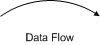
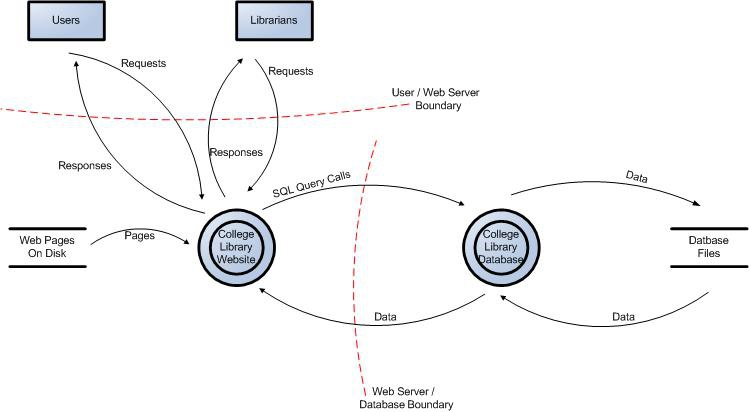

---

title: CRV2 App Threat Modeling
layout: col-sidebar
author: Larry Conklin
contributors:
tags: threat modeling
permalink: /CRV2_AppThreatModeling

---



### Introduction

Threat modeling is an approach for analyzing the security of an application. It is a structured approach that enables you to identify,
quantify, and address the security risks associated with an application. Threat modeling is not an approach to reviewing code, but it does
complement the security code review process. The inclusion of threat modeling in the SDLC can help to ensure that applications are being
developed with security built-in from the very beginning. This, combined with the documentation produced as part of the threat modeling process, can give the reviewer a greater understanding of the system. This allows the reviewer to see where the entry points to the application are and the associated threats with each entry point. The concept of threat modeling is not new but there has been a clear mindset change in recent years. Modern threat modeling looks at a system from a potential attacker's perspective, as opposed to a defender's viewpoint. Microsoft have been strong advocates of the process over the past number of years. They have made threat modeling a core component of their SDLC, which they claim to be one of the reasons for the increased security of their products in recent years.

When source code analysis is performed outside the SDLC, such as on existing applications, the results of the threat modeling help in
reducing the complexity of the source code analysis by promoting an in-depth first approach vs. breadth first approach. Instead of reviewing
all source code with equal focus, you can prioritize the security code review of components whose threat modeling has ranked with high risk
threats.

The threat modeling process can be decomposed into 3 high level steps:

**Step 1:** Decompose the Application. The first step in the threat modeling process is concerned with gaining an understanding of the
application and how it interacts with external entities. This involves creating use-cases to understand how the application is used,
identifying entry points to see where a potential attacker could interact with the application, identifying assets i.e. items/areas that
the attacker would be interested in, and identifying trust levels which represent the access rights that the application will grant to external entities. This information is documented in the Threat Model document and it is also used to produce data flow diagrams (DFDs) for the application. The DFDs show the different paths through the system, highlighting the privilege boundaries.

**Step 2:** Determine and rank threats. Critical to the identification of threats is using a threat categorization methodology. A threat
categorization such as STRIDE can be used, or the Application Security Frame (ASF) that defines threat categories such as Auditing & Logging, Authentication, Authorization, Configuration Management, Data Protection in Storage and Transit, Data Validation, Exception Management. The goal of the threat categorization is to help identify threats both from the attacker (STRIDE) and the defensive perspective (ASF). DFDs produced in step 1 help to identify the potential threat targets from the attacker's perspective, such as data sources, processes, data flows, and interactions with users. These threats can be identified further as the roots for threat trees; there is one tree for each threat goal. From the defensive perspective, ASF categorization helps to identify the threats as weaknesses of security controls for such threats. Common threat-lists with examples can help in the identification of such threats. Use and abuse cases can illustrate how existing protective measures could be bypassed, or where a lack of such protection exists. The determination
of the security risk for each threat can be determined using a value-based risk model such as DREAD or a less subjective qualitative
risk model based upon general risk factors (e.g. likelihood and impact).

**Step 3:** Determine countermeasures and mitigation. A lack of protection against a threat might indicate a vulnerability whose risk
exposure could be mitigated with the implementation of a countermeasure. Such countermeasures can be identified using threat-countermeasure
mapping lists. Once a risk ranking is assigned to the threats, it is possible to sort threats from the highest to the lowest risk, and
prioritize the mitigation effort, such as by responding to such threats by applying the identified countermeasures. The risk mitigation strategy might involve evaluating these threats from the business impact that they pose and reducing the risk. Other options might include taking the risk, assuming the business impact is acceptable because of compensating controls, informing the user of the threat, removing the risk posed by the threat completely, or the least preferable option, that is, to do nothing.

Each of the above steps are documented as they are carried out. The resulting document is the threat model for the application. This guide
will use an example to help explain the concepts behind threat modeling. The same example will be used throughout each of the 3 steps as a
learning aid. The example that will be used is a college library website. At the end of the guide we will have produced the threat model for the college library website. Each of the steps in the threat modeling process are described in detail below.

## Decompose the Application

The goal of this step is to gain an understanding of the application and how it interacts with external entities. This goal is achieved by
information gathering and documentation. The information gathering process is carried out using a clearly defined structure, which ensures
the correct information is collected. This structure also defines how the information should be documented to produce the Threat Model.

## Threat Model Information

The first item in the threat model is the information relating to the
threat model. This must include the the following:

1. **Application Name** - The name of the application.
2. **Application Version** - The version of the application.
3. **Description** - A high level description of the application.
4. **Document Owner** - The owner of the threat modeling document.
5. **Participants** - The participants involved in the threat modeling process for this application.
6. **Reviewer** - The reviewer(s) of the threat model.

Example:

<table align="center" cellspacing="1" CELLPADDING="7">
<tr bgcolor="#cccccc">
<th colspan="2" align="center">
Threat Model Information
</th>
</tr>
<tr bgcolor="#cccccc">
<th align="left">
Application Version:
</th>
<td>
1.0
</td>
</tr>
<tr bgcolor="#dddddd">
<th align="left">
Description:
</th>
<td>
The college library website is the first implementation of a website to provide librarians and library patrons (students and college staff) with online services. As this is the first implementation of the website, the functionality will be limited. There will be three users of the application:
1. Students
2. Staff
3. Librarians
Staff and students will be able to log in and search for books, and staff members can request books. Librarians will be able to log in, add
books, add users, and search for books.
</td>
</tr>
<tr bgcolor="#cccccc">
<th align="left">
Document Owner:
</th>
<td>
David Lowry
</td>
</tr>
<tr bgcolor="#dddddd">
<th align="left">
Participants:
</th>
<td>
David Rook
</td>
</tr>
<tr bgcolor="#cccccc">
<th align="left">
Reviewer:
</th>
<td>
Eoin Keary
</td>
</tr>
</table>

## External Dependencies

External dependencies are items external to the code of the application that may pose a threat to the application. These items are typically
still within the control of the organization, but possibly not within the control of the development team. The first area to look at when
investigating external dependencies is how the application will be deployed in a production environment, and what are the requirements
surrounding this. This involves looking at how the application is or is not intended to be run. For example if the application is expected to be run on a server that has been hardened to the organization's hardening standard and it is expected to sit behind a firewall, then this
information should be documented in the external dependencies section. External dependencies should be documented as follows:

1. **ID** - A unique ID assigned to the external dependency.
2. **Description** - A textual description of the external dependency.

Example:

<table align="center" cellspacing="1" CELLPADDING="7">
<tr bgcolor="#cccccc">
<th colspan="2" align="center">
External Dependencies
</th>
</tr>
<tr bgcolor="#cccccc">
<th>
ID
</th>
<th>
Description
</th>
</tr>
<tr bgcolor="#dddddd">
<td>
1
</td>
<td>
The college library website will run on a Linux server running Apache. This server will be hardened as per the college's server hardening
standard. This includes the application of the latest operating system and application security patches.
</td>
</tr>
<tr bgcolor="#cccccc">
<td>
2
</td>
<td>
The database server will be MySQL and it will run on a Linux server. This server will be hardened as per the college's server hardening
standard. This will include the application of the latest operating system and application security patches.
</td>
</tr>
<tr bgcolor="#dddddd">
<td>
3
</td>
<td>
The connection between the Web Server and the database server will be over a private network.
</td>
</tr>
<tr bgcolor="#cccccc">
<td>
4
</td>
<td>
The Web Server is behind a firewall and the only communication available is TLS.
</td>
</tr>
</table>

## Entry Points

Entry points define the interfaces through which potential attackers can interact with the application or supply it with data. In order for a potential attacker to attack an application, entry points must exist. Entry points in an application can be layered, for example each web page in a web application may contain multiple entry points. Entry points should be documented as follows:

1. **ID** - A unique ID assigned to the entry point. This will be used to cross reference the entry point with any threats or
vulnerabilities that are identified. In the case of layer entry points, a major.minor notation should be used.
2. **Name** - A descriptive name identifying the entry point and its purpose.
3. **Description** - A textual description detailing the interaction or processing that occurs at the entry point.
4. **Trust Levels** - The level of access required at the entry point is documented here. These will be cross referenced with the trusts
levels defined later in the document.

Example:

<table align="center" cellspacing="1" CELLPADDING="7">
<tr bgcolor="#cccccc">
<th colspan="4" align="center">
Entry Points
</th>
</tr>
<tr bgcolor="#cccccc">
<th width="5%">
ID
</th>
<th width="15%">
Name
</th>
<th width="45%">
Description
</th>
<th width="25%">
Trust Levels
</th>
</tr>
<tr bgcolor="#dddddd">
<td>
1
</td>
<td>
HTTPS Port
</td>
<td>
The college library website will be only be accessible via TLS. All pages within the college library website are layered on this entry
point.
</td>
<td>
(1) Anonymous Web User
(2) User with Valid Login Credentials
(3) User with Invalid Login Credentials
(4) Librarian
</tr>
<tr bgcolor="#cccccc">
<td>
1.1
</td>
<td>
Library Main Page
</td>
<td>
The splash page for the college library website is the entry point for all users.
</td>
<td>
(1) Anonymous Web User
(2) User with Valid Login Credentials
(3) User with Invalid Login Credentials
(4) Librarian
</tr>
<tr bgcolor="#dddddd">
<td>
1.2
</td>
<td>
Login Page
</td>
<td>
Students, faculty members and librarians must log in to the college
library website before they can carry out any of the use cases.
</td>
<td>
(1) Anonymous Web User
(2) User with Login Credentials
(3) User with Invalid Login Credentials
(4) Librarian
</td>
</tr>
<tr bgcolor="#cccccc">
<td>
1.2.1
</td>
<td>
Login Function
</td>
<td>
The login function accepts user supplied credentials and compares them with those in the database.
</td>
<td>
(2) User with Valid Login Credentials
(3) User with Invalid Login Credentials
(4) Librarian
</td>
</tr>
<tr bgcolor="#dddddd">
<td>
1.3
</td>
<td>
Search Entry Page
</td>
<td>
The page used to enter a search query.
</td>
<td>
(2) User with Valid Login Credentials
(4) Librarian
</td>
</tr>
</table>

## Assets

The system must have something that the attacker is interested in; these items/areas of interest are defined as assets. Assets are essentially threat targets, i.e. they are the reason threats will exist. Assets can be both physical assets and abstract assets. For example, an asset of an application might be a list of clients and their personal information; this is a physical asset. An abstract asset might be the reputation of an organization. Assets are documented in the threat model as follows:

1. **ID** - A unique ID is assigned to identify each asset. This will be used to cross reference the asset with any threats or vulnerabilities that are identified.
2. **Name** - A descriptive name that clearly identifies the asset.
3. **Description** - A textual description of what the asset is and why it needs to be protected.
4. **Trust Levels** - The level of access required to access the entry point is documented here. These will be cross referenced with the trust levels defined in the next step.

Example:

<table align="center" cellspacing="1" CELLPADDING="7">
<tr bgcolor="#cccccc">
<th colspan="4" align="center">
Assets
</th>
</tr>
<tr bgcolor="#cccccc">
<th width="5%">
ID
</th>
<th width="15%">
Name
</th>
<th width="55%">
Description
</th>
<th width="25%">
Trust Levels
</th>
</tr>
<tr bgcolor="#cccccc">
<td>
1
</td>
<td>
Library Users and Librarian
</td>
<td>
Assets relating to students, faculty members, and librarians.
</td>
<td>
</td>
</tr>
<tr bgcolor="#dddddd">
<td>
1.1
</td>
<td>
User Login Details
</td>
<td>
The login credentials that a student or a faculty member will use to log into the College Library website.
</td>
<td>
(2) User with Valid Login Credentials
(4) Librarian
(5) Database Server Administrator
(7) Web Server User Process
(8) Database Read User
(9) Database Read/Write User
</td>
</tr>
<tr bgcolor="#dddddd">
<td>
1.2
</td>
<td>
Librarian Login Details
</td>
<td>
The login credentials that a Librarian will use to log into the College Library website.
</td>
<td>
(4) Librarian
(5) Database Server Administrator
(7) Web Server User Process
(8) Database Read User
(9) Database Read/Write User
</td>
</tr>
<tr bgcolor="#dddddd">
<td>
1.3
</td>
<td>
Personal Data
</td>
<td>
The College Library website will store personal information relating to the students, faculty members, and librarians.
</td>
<td>
(4) Librarian
(5) Database Server Administrator
(6) Website Administrator
(7) Web Server User Process
(8) Database Read User
(9) Database Read/Write User
</td>
</tr>
<tr bgcolor="#cccccc">
<td>
2
</td>
<td>
System
</td>
<td>
Assets relating to the underlying system.
</td>
<td>
</td>
</tr>
<tr bgcolor="#dddddd">
<td>
2.1
</td>
<td>
Availability of College Library Website
</td>
<td>
The College Library website should be available 24 hours a day and can be accessed by all students, college faculty members, and librarians.
</td>
<td>
(5) Database Server Administrator
(6) Website Administrator
</td>
</tr>
<tr bgcolor="#dddddd">
<td>
2.2
</td>
<td>
Ability to Execute Code as a Web Server User
</td>
<td>
This is the ability to execute source code on the web server as a web server user.
</td>
<td>
(6) Website Administrator
(7) Web Server User Process
</td>
</tr>
<tr bgcolor="#dddddd">
<td>
2.3
</td>
<td>
Ability to Execute SQL as a Database Read User
</td>
<td>
This is the ability to execute SQL select queries on the database, and thus retrieve any information stored within the College Library
database.
</td>
<td>
(5) Database Server Administrator
(8) Database Read User
(9) Database Read/Write User
</td>
</tr>
<tr bgcolor="#dddddd">
<td>
2.4
</td>
<td>
Ability to Execute SQL as a Database Read/Write User
</td>
<td>
This is the ability to execute SQL. Select, insert, and update queries on the database and thus have read and write access to any information stored within the College Library database.
</td>
<td>
(5) Database Server Administrator
(9) Database Read/Write User
</td>
</tr>
<tr bgcolor="#cccccc">
<td>
3
</td>
<td>
Website
</td>
<td>
Assets relating to the College Library website.
</td>
<td>
</td>
</tr>
<tr bgcolor="#dddddd">
<td>
3.1
</td>
<td>
Login Session
</td>
<td>
This is the login session of a user to the College Library website. This user could be a student, a member of the college faculty, or a
Librarian.
</td>
<td>
(2) User with Valid Login Credentials
(4) Librarian
</td>
</tr>
<tr bgcolor="#dddddd">
<td>
3.2
</td>
<td>
Access to the Database Server
</td>
<td>
Access to the database server allows you to administer the database, giving you full access to the database users and all data contained
within the database.
</td>
<td>
(5) Database Server Administrator
</td>
</tr>
<tr bgcolor="#dddddd">
<td>
3.3
</td>
<td>
Ability to Create Users
</td>
<td>
The ability to create users would allow an individual to create new users on the system. These could be student users, faculty member users,
and librarian users.
</td>
<td>
(4) Librarian
(6) Website Administrator
</td>
</tr>
<tr bgcolor="#dddddd">
<td>
3.4
</td>
<td>
Access to Audit Data
</td>
<td>
The audit data shows all audit-able events that occurred within the College Library application by students, staff, and librarians.
</td>
<td>
(6) Website Administrator
</td>
</tr>
</table>

## Trust Levels

Trust levels represent the access rights that the application will grant to external entities. The trust levels are cross referenced with the entry points and assets. This allows us to define the access rights or privileges required at each entry point, and those required to interact with each asset. Trust levels are documented in the threat model as follows:

1. **ID** - A unique number is assigned to each trust level. This is used to cross reference the trust level with the entry points and
assets.
2. **Name** - A descriptive name that allows you to identify the external entities that have been granted this trust level.
3. **Description** - A textual description of the trust level detailing the external entity who has been granted the trust level.

Example:

<table align="center" cellspacing="1" CELLPADDING="7">
<tr bgcolor="#cccccc">
<th colspan="4" align="center">
Trust Levels
</th>
</tr>
<tr bgcolor="#cccccc">
<th width="5%">
ID
</th><th width="25%">Name</th><th width="70%">Description
</th>
</tr>
<tr bgcolor="#dddddd">
<td>
1
</td>
<td>
Anonymous Web User
</td>
<td>
A user who has connected to the college library website but has not
provided valid credentials.
</td>
</tr>
<tr bgcolor="#cccccc">
<td>
2
</td>
<td>
User with Valid Login Credentials
</td>
<td>
A user who has connected to the college library website and has logged
in using valid login credentials.
</td>
</tr>
<tr bgcolor="#cccccc">
<td>
3
</td>
<td>
User with Invalid Login Credentials
</td>
<td>
A user who has connected to the college library website and is
attempting to log in using invalid login credentials.
</td>
</tr>
<tr bgcolor="#dddddd">
<td>
4
</td>
<td>
Librarian
</td>
<td>
The librarian can create users on the library website and view their
personal information.
</td>
</tr>
<tr bgcolor="#cccccc">
<td>
5
</td>
<td>
Database Server Administrator
</td>
<td>
The database server administrator has read and write access to the
database that is used by the college library website.
</td>
</tr>
<tr bgcolor="#dddddd">
<td>
6
</td>
<td>
Website Administrator
</td>
<td>
The Website administrator can configure the college library website.
</td>
</tr>
<tr bgcolor="#cccccc">
<td>
7
</td>
<td>
Web Server User Process
</td>
<td>
This is the process/user that the web server executes code as and
authenticates itself against the database server as.
</td>
</tr>
<tr bgcolor="#dddddd">
<td>
8
</td>
<td>
Database Read User
</td>
<td>
The database user account used to access the database for read access.
</td>
</tr>
<tr bgcolor="#cccccc">
<td>
9
</td>
<td>
Database Read/Write User
</td>
<td>
The database user account used to access the database for read and write
access.
</td>
</tr>
</table>

## Data Flow Diagrams

All of the information collected allows us to accurately model the application through the use of Data Flow Diagrams (DFDs). The DFDs will
allow us to gain a better understanding of the application by providing a visual representation of how the application processes data. The focus of the DFDs is on how data moves through the application and what happens to the data as it moves. DFDs are hierarchical in structure, so they can be used to decompose the application into subsystems and lower-level subsystems. The high level DFD will allow us to clarify the scope of the application being modeled. The lower level iterations will allow us to focus on the specific processes involved when processing specific data. There are a number of symbols that are used in DFDs for threat modeling. These are described below:

**External Entity**
The external entity shape is used to represent any entity outside the application that interacts with the application via an entry point.

**Process**
The process shape represents a task that handles data within the application. The task may process the data or perform an action based on
the data.

**Multiple Process**
The multiple process shape is used to present a collection of subprocesses. The multiple process can be broken down into its
subprocesses in another DFD.

**Data Store**
The data store shape is used to represent locations where data is stored. Data stores do not modify the data, they only store data.

**Data Flow**
The data flow shape represents data movement within the application. The direction of the data movement is represented by the arrow.

**Privilege Boundary**
The privilege boundary shape is used to represent the change of privilege levels as the data flows through the application.

### Example

**Data Flow Diagram for the College Library Website**

**User Login Data Flow Diagram for the College Library Website**

## Determine and Rank Threats

### Threat Categorization

The first step in the determination of threats is adopting a threat categorization. A threat categorization provides a set of threat
categories with corresponding examples so that threats can be systematically identified in the application in a structured and
repeatable manner.

#### STRIDE

A threat categorization such as STRIDE is useful in the identification of threats by classifying attacker goals such as:

- Spoofing
- Tampering
- Repudiation
- Information Disclosure
- Denial of Service
- Elevation of Privilege.

A threat list of generic threats organized in these categories with examples and the affected security controls is provided in the following
table:

<table align="center" cellspacing="1" CELLPADDING="7">
<tr bgcolor="#cccccc">
<th colspan="4" align="center">
STRIDE Threat List
</th>
</tr>
<tr bgcolor="#cccccc">
<th>
Type
</th>
<th>
Examples
</th>
<th>
Security Control
</th>
</tr>
<tr bgcolor="#cccccc">
<td>
Spoofing
</td>
<td>
Threat action aimed to illegally access and use another user's
credentials, such as username and password.
</td>
<td>
Authentication
</td>
</tr>
<tr bgcolor="#cccccc">
<td>
Tampering
</td>
<td>
Threat action aimed to maliciously change/modify persistent data, such
as persistent data in a database, and the alteration of data in transit
between two computers over an open network, such as the Internet.
</td>
<td>
Integrity
</td>
</tr>
<tr bgcolor="#dddddd">
<td>
Repudiation
</td>
<td>
Threat action aimed to perform illegal operations in a system that lacks
the ability to trace the prohibited operations.
</td>
<td>
Non-Repudiation
</td>
</tr>
<tr bgcolor="#cccccc">
<td>
Information disclosure
</td>
<td>
Threat action to read a file that one was not granted access to, or to
read data in transit.
</td>
<td>
Confidentiality
</td>
</tr>
<tr bgcolor="#dddddd">
<td>
Denial of service
</td>
<td>
Threat aimed to deny access to valid users, such as by making a web
server temporarily unavailable or unusable.
</td>
<td>
Availability
</td>
</tr>
<tr bgcolor="#cccccc">
<td>
Elevation of privilege
</td>
<td>
Threat aimed to gain privileged access to resources for gaining unauthorized access to information or to compromise a system.
</td>
<td>
Authorization
</td>
</table>

## Threat Analysis

The prerequisite in the analysis of threats is the understanding of the generic definition of risk that is the probability that a threat agent will exploit a vulnerability to cause an impact to the application. From the perspective of risk management, threat modeling is the systematic and strategic approach for identifying and enumerating threats to an application environment with the objective of minimizing risk and the associated impacts.

Threat analysis as such is the identification of the threats to the application, and involves the analysis of each aspect of the application
functionality and architecture and design to identify and classify potential weaknesses that could lead to an exploit.

In the first threat modeling step, we have modeled the system showing data flows, trust boundaries, process components, and entry and exit
points. An example of such modeling is shown in the Example: Data Flow Diagram for the College Library Website.

Data flows show how data flows logically through the end to end, and allows the identification of affected components through critical points (i.e. data entering or leaving the system, storage of data) and the flow of control through these components. Trust boundaries show any location where the level of trust changes. Process components show where data is processed, such as web servers, application servers, and database servers. Entry points show where data enters the system (i.e. input fields, methods) and exit points are where it leaves the system (i.e. dynamic output, methods), respectively. Entry and exit points define a trust boundary.

Threat lists based on the STRIDE model are useful in the identification of threats with regards to the attacker goals. For example, if the
threat scenario is attacking the login, would the attacker brute force the password to break the authentication? If the threat scenario is to try to elevate privileges to gain another user’s privileges, would the attacker try to perform forceful browsing?

It is vital that all possible attack vectors should be evaluated from the attacker’s point of view. For this reason, it is also important to
consider entry and exit points, since they could also allow the realization of certain kinds of threats. For example, the login page
allows sending authentication credentials, and the input data accepted by an entry point has to validate for potential malicious input to
exploit vulnerabilities such as SQL injection, cross site scripting, and buffer overflows. Additionally, the data flow passing through that point has to be used to determine the threats to the entry points to the next components along the flow. If the following components can be regarded critical (e.g. the hold sensitive data), that entry point can be regarded more critical as well. In an end to end data flow, for example, the input data (i.e. username and password) from a login page, passed on without validation, could be exploited for a SQL injection attack to manipulate a query for breaking the authentication or to modify a table in the database.

Exit points might serve as attack points to the client (e.g. XSS vulnerabilities) as well for the realization of information disclosure
vulnerabilities. For example, in the case of exit points from components handling confidential data (e.g. data access components), exit points lacking security controls to protect the confidentiality and integrity can lead to disclosure of such confidential information to an
unauthorized user.

In many cases threats enabled by exit points are related to the threats of the corresponding entry point. In the login example, error messages returned to the user via the exit point might allow for entry point attacks, such as account harvesting (e.g. username not found), or SQL injection (e.g. SQL exception errors).

From the defensive perspective, the identification of threats driven by security control categorization such as ASF, allows a threat analyst to
focus on specific issues related to weaknesses (e.g. vulnerabilities) in security controls. Typically the process of threat identification
involves going through iterative cycles where initially all the possible threats in the threat list that apply to each component are evaluated.

At the next iteration, threats are further analyzed by exploring the attack paths, the root causes (e.g. vulnerabilities, depicted as orange
blocks) for the threat to be exploited, and the necessary mitigation controls (e.g. countermeasures, depicted as green blocks). A threat tree as shown in figure 2 is useful to perform such threat analysis

Once common threats, vulnerabilities, and attacks are assessed, a more focused threat analysis should take in consideration use and abuse
cases. By thoroughly analyzing the use scenarios, weaknesses can be identified that could lead to the realization of a threat. Abuse cases
should be identified as part of the security requirement engineering activity. These abuse cases can illustrate how existing protective
measures could be bypassed, or where a lack of such protection exists. A use and misuse case graph for authentication is shown in figure below:

Finally, it is possible to bring all of this together by determining the types of threat to each component of the decomposed system. This can be done by using a threat categorization such as STRIDE or ASF, the use of threat trees to determine how the threat can be exposed by a
vulnerability, and use and misuse cases to further validate the lack of a countermeasure to mitigate the threat.

To apply STRIDE to the data flow diagram items the following table can be used:

TABLE

## Ranking of Threats

Threats can be ranked from the perspective of risk factors. By determining the risk factor posed by the various identified threats, it
is possible to create a prioritized list of threats to support a risk mitigation strategy, such as deciding on which threats have to be
mitigated first. Different risk factors can be used to determine which threats can be ranked as High, Medium, or Low risk. In general, threat risk models use different factors to model risks such as those shown in figure below:

## DREAD

In the Microsoft DREAD threat-risk ranking model, the technical risk factors for impact are Damage and Affected Users, while the ease of
exploitation factors are Reproducibility, Exploitability and Discoverability. This risk factorization allows the assignment of values
to the different influencing factors of a threat. To determine the ranking of a threat, the threat analyst has to answer basic questions
for each factor of risk, for example:

- For Damage: How big would the damage be if the attack succeeded?
- For Reproducibility: How easy is it to reproduce an attack to work?
- For Exploitability: How much time, effort, and expertise is needed to exploit the threat?
- For Affected Users: If a threat were exploited, what percentage of users would be affected?
- For Discoverability: How easy is it for an attacker to discover this threat?

By referring to the college library website it is possible to document sample threats releated to the use cases such as:

**Threat: Malicious user views confidential information of students, faculty members and librarians.**

1. **Damage potential:** Threat to reputation as well as financial and legal liability:8
2. **Reproducibility:** Fully reproducible:10
3. **Exploitability:** Require to be on the same subnet or have compromised a router:7
4. **Affected users:** Affects all users:10
5. **Discoverability:** Can be found out easily:10

Overall DREAD score: (8+10+7+10+10) / 5 = 9

In this case having 9 on a 10 point scale is certainly an high risk threat

## Generic Risk Model

A more generic risk model takes into consideration the Likelihood (e.g. probability of an attack) and the Impact (e.g. damage potential):

**Risk = Likelihood x Impact**

The likelihood or probability is defined by the ease of exploitation, which mainly depends on the type of threat and the system
characteristics, and by the possibility to realize a threat, which is determined by the existence of an appropriate countermeasure.

The following is a set of considerations for determining ease of exploitation:

1. Can an attacker exploit this remotely?
2. Does the attacker need to be authenticated?
3. Can the exploit be automated?

The impact mainly depends on the damage potential and the extent of the impact, such as the number of components that are affected by a threat.

Examples to determine the damage potential are:

1. Can an attacker completely take over and manipulate the system?
2. Can an attacker gain administration access to the system?
3. Can an attacker crash the system?
4. Can the attacker obtain access to sensitive information such as secrets, PII

Examples to determine the number of components that are affected by a threat:

1. How many data sources and systems can be impacted?
2. How “deep” into the infrastructure can the threat agent go?

These examples help in the calculation of the overall risk values by assigning qualitative values such as High, Medium and Low to Likelihood
and Impact factors. In this case, using qualitative values, rather than numeric ones like in the case of the DREAD model, help avoid the ranking becoming overly subjective.

## Countermeasure Identification

The purpose of the countermeasure identification is to determine if there is some kind of protective measure (e.g. security control, policy
measures) in place that can prevent each threat previously identified via threat analysis from being realized. Vulnerabilities are then those threats that have no countermeasures. Since each of these threats has been categorized either with STRIDE or ASF, it is possible to find appropriate countermeasures in the application within the given category.

Provided below is a brief and limited checklist which is by no means an exhaustive list for identifying countermeasures for specific threats.

Example of countermeasures for ASF threat types are included in the following table:

<table align="center" cellspacing="1" CELLPADDING="7">
<tr bgcolor="#cccccc">
<th colspan="4" align="center">
ASF Threat & Countermeasures List
</th>
</tr>
<tr bgcolor="#cccccc">
<th>
Threat Type
</th>
<th>
Countermeasure
</th>
</tr>
<tr bgcolor="#cccccc">
<td>
Authentication
</td>
<td>
1. Credentials and authentication tokens are protected with encryption in storage and transit
2. Protocols are resistant to brute force, dictionary, and replay attacks
3. Strong password policies are enforced
4. Trusted server authentication is used instead of SQL authentication
5. Passwords are stored with salted hashes
6. Password resets do not reveal password hints and valid usernames
7. Account lockouts do not result in a denial of service attack
</td>
</tr>
<tr bgcolor="#cccccc">
<td>
Authorization
</td>
<td>
1. Strong ACLs are used for enforcing authorized access to resources
2. Role-based access controls are used to restrict access to specific operations
3. The system follows the principle of least privilege for user and service accounts
4. Privilege separation is correctly configured within the presentation, business and data access layers
</td>
</tr>
<tr bgcolor="#cccccc">
<td>
Configuration Management
</td>
<td>
1. Least privileged processes are used and service accounts with no administration capability
2. Auditing and logging of all administration activities is enabled
3. Access to configuration files and administrator interfaces is restricted to administrators
</td>
</tr>
<tr bgcolor="#cccccc">
<td>
Data Protection in Storage and Transit
</td>
<td>
1. Standard encryption algorithms and correct key sizes are being used
2. Hashed message authentication codes (HMACs) are used to protect data integrity
3. Secrets (e.g. keys, confidential data ) are cryptographically protected both in transport and in storage
4. Built-in secure storage is used for protecting keys
5. No credentials and sensitive data are sent in clear text over the wire
</td>
</tr>
<tr bgcolor="#cccccc">
<td>
Data Validation / Parameter Validation
</td>
<td>
1. Data type, format, length, and range checks are enforced
2. All data sent from the client is validated
3. No security decision is based upon parameters (e.g. URL parameters) that can be manipulated
4. Input filtering via allow list validation is used
5. Output encoding is used
</td>
</tr>
<tr bgcolor="#cccccc">
<td>
Error Handling and Exception Management
</td>
<td>
1. All exceptions are handled in a structured manner
2. Privileges are restored to the appropriate level in case of errors and exceptions
3. Error messages are scrubbed so that no sensitive information is revealed to the attacker
</td>
</tr>
<tr bgcolor="#cccccc">
<td>
User and Session Management
</td>
<td>
1. No sensitive information is stored in clear text in the cookie
2. The contents of the authentication cookies is encrypted
3. Cookies are configured to expire
4. Sessions are resistant to replay attacks
5. Secure communication channels are used to protect authentication cookies
6. User is forced to re-authenticate when performing critical functions
7. Sessions are expired at logout
</td>
</tr>
<tr bgcolor="#cccccc">
<td>
Auditing and Logging
</td>
<td>
1. Sensitive information (e.g. passwords, PII) is not logged
2. Access controls (e.g. ACLs) are enforced on log files to prevent un-authorized access
3. Integrity controls (e.g. signatures) are enforced on log files to provide non-repudiation
4. Log files provide for audit trail for sensitive operations and logging of key events
5. Auditing and logging is enabled across the tiers on multiple servers
</td>
</tr>
</table>

When using STRIDE, the following threat-mitigation table can be used to identify techniques that can be employed to mitigate the threats.

<table align="center" cellspacing="1" CELLPADDING="7">
<tr bgcolor="#cccccc">
<th colspan="4" align="center">
STRIDE Threat & Mitigation Techniques List
</th>
</tr>
<tr bgcolor="#cccccc">
<th>
Threat Type
</th>
<th>
Mitigation Techniques
</th>
</tr>
<tr bgcolor="#cccccc">
<td>
Spoofing Identity
</td>
<td>
1. Appropriate authentication
2. Protect secret data
3. Don't store secrets
</td>
</tr>
<tr bgcolor="#cccccc">
<td>
Tampering with data
</td>
<td>
1. Appropriate authorization
2. Hashes
3. MACs
4. Digital signatures
5. Tamper resistant protocols
</td>
</tr>
<tr bgcolor="#cccccc">
<td>
Repudiation
</td>
<td>
1. Digital signatures
2. Timestamps
3. Audit trails
</td>
</tr>
<tr bgcolor="#cccccc">
<td>
Information Disclosure
</td>
<td>
1. Authorization
2. Privacy-enhanced protocols
3. Encryption
4. Protect secrets
5. Don't store secrets
</td>
</tr>
<tr bgcolor="#cccccc">
<td>
Denial of Service
</td>
<td>
1. Appropriate authentication
2. Appropriate authorization
3. Filtering
4. Throttling
5. Quality of service
</td>
</tr>
<tr bgcolor="#cccccc">
<td>
Elevation of privilege
</td>
<td>
1. Run with least privilege
</td>
</tr>
</table>

Once threats and corresponding countermeasures are identified it is possible to derive a threat profile with the following criteria:

1. **Non mitigated threats:** Threats which have no countermeasures and represent vulnerabilities that can be fully exploited and cause an impact
2. **Partially mitigated threats:** Threats partially mitigated by one or more countermeasures which represent vulnerabilities that can only partially be exploited and cause a limited impact
3. **Fully mitigated threats:** These threats have appropriate countermeasures in place and do not expose vulnerability and cause impact
