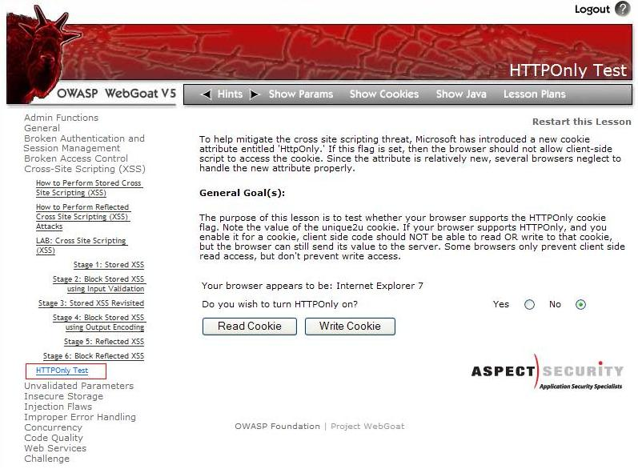
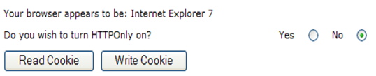
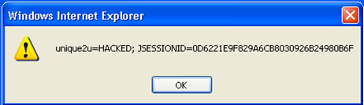
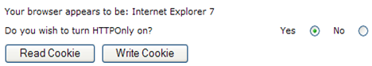
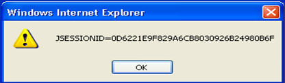
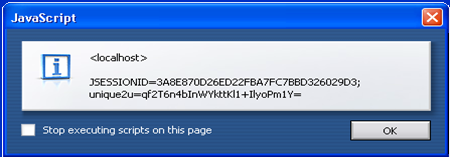



## Overview

The goal of this section is to introduce, discuss, and provide language specific mitigation techniques for HttpOnly.

### Who developed HttpOnly? When?

According to a daily blog article by [Jordan Wiens, “No cookie for
you!”](http://www.networkcomputing.com/careers/no-cookie-you/1270585242),
HttpOnly cookies were first implemented in 2002 by Microsoft Internet
Explorer developers for Internet Explorer 6 SP1.

### What is HttpOnly?

According to the [Microsoft Developer
Network](http://msdn2.microsoft.com/en-us/library/ms533046.aspx),
HttpOnly is an *additional flag* included in a Set-Cookie HTTP response
header. Using the HttpOnly flag when generating a cookie helps mitigate
the risk of client side script accessing the protected cookie (if the
browser supports it).

- The example below shows the syntax used within the **HTTP response
header**:

```
Set-Cookie: <name>=<value>[; <Max-Age>=<age>]
`[; expires=<date>][; domain=<domain_name>]
[; path=<some_path>][; secure][; HttpOnly]
```

If the HttpOnly flag (optional) is included in the HTTP response header,
the cookie cannot be accessed through client side script (again if the
browser supports this flag). As a result, even if a cross-site scripting
**(XSS)** flaw exists, and a user accidentally accesses a link that
exploits this flaw, the browser (primarily Internet Explorer) will not
reveal the cookie to a third party.

If a browser does not support HttpOnly and a website attempts to set an
HttpOnly cookie, the HttpOnly flag will be ignored by the browser, thus
creating a traditional, script accessible cookie. As a result, the
cookie (typically your session cookie) becomes vulnerable to theft or
modification by malicious script.
[Mitigating](http://msdn2.microsoft.com/en-us/library/ms533046.aspx).

### Mitigating the Most Common XSS attack using HttpOnly

According to [Michael Howard](http://msdn2.microsoft.com/en-us/library/ms972826.aspx), Senior
Security Program Manager in the Secure Windows Initiative group at
Microsoft, the majority of XSS attacks target theft of session cookies.
A server could help mitigate this issue by setting the HttpOnly flag on
a cookie it creates, indicating the cookie should not be accessible on
the client.

If a browser that supports HttpOnly detects a cookie containing the
HttpOnly flag, and client side script code attempts to read the cookie,
the browser *returns an empty string* as the result. This causes the
attack to fail by preventing the malicious (usually XSS) code from
sending the data to an attacker's website.

##### Using Java to Set HttpOnly

Since Java Enterprise Edition 6 (JEE 6), which adopted Java Servlet 3.0
technology, it's programmatically easy to set the HttpOnly flag on a
cookie.

In fact `setHttpOnly` and `isHttpOnly` methods are available in the
`Cookie` interface
[JEE 6](http://java.sun.com/javaee/6/docs/api/javax/servlet/http/Cookie.html#setHttpOnly%28boolean%29),
[JEE 7](https://docs.oracle.com/javaee/7/api/javax/servlet/http/Cookie.html#setHttpOnly-boolean-)
and also for session cookies (JSESSIONID)
[JEE 6](http://java.sun.com/javaee/6/docs/api/javax/servlet/SessionCookieConfig.html#setHttpOnly%28boolean%29),
[JEE 7](https://docs.oracle.com/javaee/7/api/javax/servlet/SessionCookieConfig.html#setHttpOnly-boolean-)
`cookie.setHttpOnly(true);`

Moreover, since JEE 6 it's also declaratively easy setting `HttpOnly`
flag in a session cookie by applying the following configuration in the
deployment descriptor `WEB-INF/web.xml`:

```xml
<session-config>
   <cookie-config>
    <http-only>true</http-only>
   </cookie-config>
</session-config>
```

For Java Enterprise Edition versions *prior* to JEE 6 a common
**workaround** is to overwrite the `SET-COOKIE` HTTP response header
with a session cookie value that explicitly appends the `HttpOnly` flag:

```java
String sessionid = request.getSession().getId();
// be careful overwriting: JSESSIONID may have been set with other flags
response.setHeader("SET-COOKIE", "JSESSIONID=" + sessionid + "; HttpOnly");
```

In this context, overwriting, despite appropriate for the `HttpOnly`
flag, is discouraged because the JSESSIONID may have been set with other
flags. A better workaround is taking care of the previously set flags or
using the [ESAPI\#Java_EE](https://owasp.org/www-project-enterprise-security-api/) library: in fact
the `addCookie` method of the `SecurityWrapperResponse`
[3](http://code.google.com/p/owasp-esapi-java/source/browse/tags/esapi-2.0.1/src/main/java/org/owasp/esapi/filters/SecurityWrapperResponse.java)
takes care of previously set flags for us. So we could write a servlet
filter as the following one:

```java
public void doFilter(ServletRequest request, ServletResponse response, FilterChain filterChain) throws IOException, ServletException {
    HttpServletRequest httpServletRequest = (HttpServletRequest) request;
    HttpServletResponse httpServletResponse = (HttpServletResponse) response;
    // if errors exist then create a sanitized cookie header and continue
    SecurityWrapperResponse securityWrapperResponse = new SecurityWrapperResponse(httpServletResponse, "sanitize");
    Cookie[] cookies = httpServletRequest.getCookies();
    if (cookies != null) {
        for (int i = 0; i < cookies.length; i++) {
            Cookie cookie = cookies[i];
            if (cookie != null) {
                // ESAPI.securityConfiguration().getHttpSessionIdName() returns JSESSIONID by default configuration
                if (ESAPI.securityConfiguration().getHttpSessionIdName().equals(cookie.getName())) {
                    securityWrapperResponse.addCookie(cookie);
                }
            }
        }
    }
    filterChain.doFilter(request, response);
}
```

Some web application servers, that implement JEE 5, and servlet
containers that implement Java Servlet 2.5 (part of JEE 5), also allow
creating HttpOnly session cookies:

- **Tomcat 6** In `context.xml` set the `context` tag's attribute `useHttpOnly`
[4](http://tomcat.apache.org/tomcat-6.0-doc/config/context.html#Common_Attributes)
as follow:

```xml
<?xml version="1.0" encoding="UTF-8"?>
<Context path="/myWebApplicationPath" useHttpOnly="true">
```

- **JBoss 5.0.1** and **JBOSS EAP 5.0.1** In
`server <myJBossServerInstance> \deploy\jbossweb.sar\context.xml`
set the `SessionCookie` tag
[5](https://community.jboss.org/message/598558#598558) as follow:

```xml
<Context cookies="true" crossContext="true">
    <SessionCookie secure="true" httpOnly="true" />
```

- **IBM Websphere** offer HTTPOnly for session cookies as a [configuration option](http://pic.dhe.ibm.com/infocenter/tivihelp/v33r1/topic/com.ibm.mam.inswas.doc/install/t_configuringthehttponlyattribute.html)

##### Using .NET to Set HttpOnly

- By *default*, **.NET 2.0** sets the HttpOnly attribute for
1. Session ID
2. Forms Authentication cookie

In .NET 2.0, HttpOnly can also be set via the HttpCookie object for all custom application cookies

- Via **web.config** in the system.web/httpCookies element

`<httpCookies httpOnlyCookies="true" …> `

- Or **programmatically**

C# Code:

```C#
HttpCookie myCookie = new HttpCookie("myCookie");
myCookie.HttpOnly = true;
Response.AppendCookie(myCookie);
```

VB.NET Code:

```vb
Dim myCookie As HttpCookie = new HttpCookie("myCookie")
myCookie.HttpOnly = True
Response.AppendCookie(myCookie)
```

- However, in **.NET 1.1**, you would have to do this *manually*,
e.g.,

`Response.Cookies[cookie].Path += ";HttpOnly";`

##### Using Python (cherryPy) to Set HttpOnly

Python Code (cherryPy):
To use HTTP-Only cookies with Cherrypy sessions just add the following
line in your configuration file:
`tools.sessions.httponly = True`
If you use SLL you can also make your cookies secure (encrypted) to
avoid "manipulator-in-the-middle" cookies reading with:
`tools.sessions.secure = True`

##### Using PHP to set HttpOnly

PHP supports setting the HttpOnly flag since version 5.2.0 (November
2006).

For session cookies managed by PHP, the flag is set either permanently
in php.ini [PHP manual on
*HttpOnly*](http://www.php.net/manual/en/session.configuration.php#ini.session.cookie-httponly)
through the parameter:

`session.cookie_httponly = True`

or in and during a script via the
function[6](http://pl.php.net/manual/en/function.session-set-cookie-params.php):

```
void session_set_cookie_params  ( int $lifetime  [, string $path  [, string $domain
                                  [, bool $secure= false  [, bool $httponly= false  ]]]] )
```

For application cookies last parameter in setcookie() sets HttpOnly
flag[7](http://pl.php.net/setcookie):

```
bool setcookie  ( string $name  [, string $value  [, int $expire= 0  [, string $path
                 [, string $domain  [, bool $secure= false  [, bool $httponly= false  ]]]]]] )
```

### Web Application Firewalls

If code changes are infeasible, web application firewalls can be used to
add HttpOnly to session cookies:

- Mod_security - using SecRule and Header
directives[8](http://blog.modsecurity.org/2008/12/fixing-both-missing-httponly-and-secure-cookie-flags.html)
- ESAPI
WAF[9](http://code.google.com/p/owasp-esapi-java/downloads/list)
using *add-http-only-flag*
directive[10](http://www.slideshare.net/llamakong/owasp-esapi-waf-appsec-dc-2009)

## Browsers Supporting HttpOnly

Using WebGoat's HttpOnly lesson, the following web browsers have been
tested for HttpOnly support. If the browsers enforces HttpOnly, a client
side script will be unable to read or write the session cookie. However,
there is currently no prevention of reading or writing the session
cookie via a XMLHTTPRequest.

Note: These results may be out of date as this page is not well
maintained. A great page that is focused on keeping up with the status
of browsers is at: [Browserscope](http://www.browserscope.org/?category=security).
Just look at the HttpOnly column. The Browserscope site does not provide
as much detail on HttpOnly as this page, but provides lots of other
details this page does not.

Our results as of Feb 2009 are listed below in **table 1**.

| **Browser**                 | **Version**                   | **Prevents Reads** | **Prevents Writes** | **Prevents Read within XMLHTTPResponse\***                                                                                                                                                        |
| ----------------------------| ----------------------------- | ------------------ | ------------------- | ------------------------------------------------------------------------------------------------------------------------------------------------------------------------------------------------- |
| Microsoft Internet Explorer | 8 Beta 2                      | Yes                | Yes                 | Partially (set-cookie is protected, but not set-cookie2, see [11](http://www.microsoft.com/technet/security/bulletin/ms08-069.mspx)). Fully patched IE8 passes <http://ha.ckers.org/httponly.cgi> |
| Microsoft Internet Explorer | 7                             | Yes                | Yes                 | Partially (set-cookie is protected, but not set-cookie2, see [12](http://www.microsoft.com/technet/security/bulletin/ms08-069.mspx)). Fully patched IE7 passes <http://ha.ckers.org/httponly.cgi> |
| Microsoft Internet Explorer | 6 (SP1)                       | Yes                | No                  | No (Possible that ms08-069 fixed IE 6 too, please verify with <http://ha.ckers.org/httponly.cgi> and update this page\!)                                                                          |
|                             |                               |                    |                     |                                                                                                                                                                                                   |
| Microsoft Internet Explorer | 6 (fully patched)             | Yes                | Unknown             | Yes                                                                                                                                                                                               |
| Mozilla Firefox             | 3.0.0.6+                      | Yes                | Yes                 | Yes (see [13](http://manicode.blogspot.com/2009/02/firefox-3006-httponly-champion.html))                                                                                                          |
| Netscape Navigator          | 9.0b3                         | Yes                | Yes                 | No                                                                                                                                                                                                |
| Opera                       | 9.23                          | No                 | No                  | No                                                                                                                                                                                                |
| Opera                       | 9.50                          | Yes                | No                  | No                                                                                                                                                                                                |
| Opera                       | 11                            | Yes                | Unknown             | Yes                                                                                                                                                                                               |
| Safari                      | 3.0                           | No                 | No                  | No (almost yes, see [14](https://bugs.webkit.org/show_bug.cgi?id=10957))                                                                                                                          |
| Safari                      | 5                             | Yes                | Yes                 | Yes                                                                                                                                                                                               |
| iPhone (Safari)             | iOS 4                         | Yes                | Yes                 | Yes                                                                                                                                                                                               |
| Google's Chrome             | Beta (initial public release) | Yes                | No                  | No (almost yes, see [15](https://bugs.webkit.org/show_bug.cgi?id=10957))                                                                                                                          |
| Google's Chrome             | 12                            | Yes                | Yes                 | Yes                                                                                                                                                                                               |
| Android                     | Android 2.3                   | Unknown            | Unknown             | No                                                                                                                                                                                                |

**Table 1:** Browsers Supporting HttpOnly

\* An attacker could still read the session cookie in a response to an
\*\*[XmlHttpRequest](http://ha.ckers.org/blog/20070719/firefox-implements-httponly-and-is-vulnerable-to-xmlhttprequest/).

As of 2011, 99% of browsers and most web application frameworks support
HttpOnly\[1\].

## Using WebGoat to Test for HttpOnly Support

The goal of this section is to provide a step-by-step example of testing
your browser for HttpOnly support.

### WARNING

The OWASP WEBGOAT HttpOnly lab is broken and does not show IE 8 Beta 2
with ms08-069 as complete in terms of HttpOnly XMLHTTPRequest header
leakage protection. This error is being tracked via
[Issue 18](http://code.google.com/p/webgoat/issues/detail?id=18).

### Getting Started



Assuming you have installed and launched WebGoat, begin by navigating to
the **‘HttpOnly Test’ lesson** located within the Cross-Site Scripting
(**XSS**) category. After loading the ‘HttpOnly Test’ lesson, as shown
in **figure 1**, you are now able to begin testing web browsers
supporting HttpOnly.

### Lesson Goal

If the *HttpOnly flag* is set, then your browser should not allow a
client-side script to access the session cookie. Unfortunately, since
the attribute is relatively new, several browsers may neglect to handle
the new attribute properly.

The **purpose** of this lesson is to test whether your browser supports
the **HttpOnly cookie flag**. *Note the value of the* ***unique2u
cookie***. If your browser supports HttpOnly, and you *enable* it for a
cookie, a client-side script should NOT be able to read OR write to that
cookie, but the browser can still send its value to the server. However,
some browsers only prevent client side read access, but do not prevent
write access.

### Testing Web Browsers for HttpOnly Support

The following test was performed on two browsers, **Internet Explorer
7** and **Opera 9.22**, to demonstrate the results when the HttpOnly
flag is enforced properly. As you will see, IE7 properly enforces the
HttpOnly flag, whereas Opera does not properly enforce the HttpOnly
flag.

##### Disabling HttpOnly

1) Select the option to **turn HttpOnly off** as shown below in **Figure 2**.



2) After turning HttpOnly off, select the **“Read Cookie”** button.

- An alert dialog box will display on the screen notifying you that
*since HttpOnly was not enabled*, the **‘unique2u’ cookie** was
successfully read as shown below in **figure 3**.


3) With HttpOnly remaining disabled, select the **“Write Cookie”** button.

- An alert dialog box will display on the screen notifying you that
*since HttpOnly was not enabled*, the **‘unique2u’ cookie** was
successfully modified on the client side as shown below in **figure
4**.



- As you have seen thus far, **browsing without HttpOnly** on is a
potential ***threat***. Next, we will **enable HttpOnly** to
demonstrate how this flag protects the cookie.

##### Enabling HttpOnly

4) Select the *radio button* to enable HttpOnly as shown below in **figure 5**.



5) After enabling HttpOnly, select the **"Read Cookie"** button.

- If the browser enforces the HttpOnly flag properly, an alert dialog
box will display only the session ID rather than the contents of the
**‘unique2u’ cookie** as shown below in **figure 6**.



- However, if the browser does not enforce the HttpOnly flag properly,
an alert dialog box will display both the **‘unique2u’ cookie** and
session ID as shown below in **figure 7**.



- Finally, we will test if the browser allows **write access** to the
cookie with HttpOnly enabled.

6) Select the **"Write Cookie"** button.

- If the browser enforces the HttpOnly flag properly, client side
modification will be unsuccessful in writing to the **‘unique2u’
cookie** and an alert dialog box will display only containing the
session ID as shown below in **figure 8**.


- However, if the browser does not enforce the write protection
property of HttpOnly flag for the **‘unique2u’ cookie**, the cookie
will be successfully modified to *HACKED* on the client side as
shown below in **figure 9**.


## References

1. [CWE-1004: Sensitive Cookie Without 'HttpOnly' Flag](https://cwe.mitre.org/data/definitions/1004.html)
2. Wiens, Jordan ["No cookie for you!"](http://www.networkcomputing.com/careers/no-cookie-you/1270585242)
3. [Mitigating Cross-site Scripting with HTTP-Only Cookies](http://msdn2.microsoft.com/en-us/library/ms533046.aspx)
4. Howard, Michael. [Some Bad News and Some Good News](http://msdn2.microsoft.com/en-us/library/ms972826.aspx)
5. MSDN. [Setting the HttpOnly property in .NET](http://msdn.microsoft.com/en-us/library/system.web.httpcookie.httponly.aspx)
6. [XSS: Gaining access to HttpOnly Cookie in 2012](http://seckb.yehg.net/2012/06/xss-gaining-access-to-httponly-cookie.html)
7. [Setting HttpOnly in Java](http://stackoverflow.com/questions/13147113/setting-an-httponly-cookie-with-javax-servlet-2-5)
8. [Misunderstandings on HttpOnly Cookie](https://web.archive.org/web/20130701055119/http://blog.fortify.com:80/blog/2011/11/02/Misunderstandings-on-HttpOnly-Cookie)
