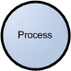
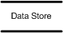

---

title: Threat Modeling Process
layout: col-sidebar
author: Larry Conklin
contributors: ["Victoria Drake", "Sven strittmatter", "Zoe Braiterman", "Adam Shostack"]
tags: ["threat modeling"]
permalink: /Threat_Modeling_Process
---



This is an OWASP community page. You should also visit the official [Threat Model Project](https://owasp.org/www-project-threat-model/) site.

- [Introduction](#introduction)
  - [Step 1: Scope your work](#step-1-scope-your-work)
  - [Step 2: Determine Threats](#step-2-determine-threats)
  - [Step 3: Determine Countermeasures and Mitigation](#step-3-determine-countermeasures-and-mitigation)
  - [Step 4: Assess your work](#step-4-assess-your-work)
- [Scope your work (Samples)](#sample-scope-the-work)
    - [Threat Model Information](#threat-model-information-sample)
    - [External Dependencies](#external-dependencies-sample)
    - [Entry Points](#entry-points)
    - [Exit Points](#exit-points)
    - [Assets](#assets)
    - [Trust Levels](#trust-levels)
    - [Data Flow Diagrams](#data-flow-diagrams)
    - [Example Diagrams](#example-diagrams)
  - [Determine Threats (samples) ](#determine-threats-sample)
    - [STRIDE](#stride)
      - [STRIDE Threat List (sample)](#stride-threat-list)
        - [Threat Analysis](#threat-analysis)
        - [Ranking of Threats](#ranking-of-threats)
        - [Qualitative Risk Model](#qualitative-risk-model)
  - [Determine Countermeasures and Mitigation (Sample)](#determine-countermeasures-and-mitigation)
    - [STRIDE Threat & Mitigation Techniques](#stride-threat--mitigation-techniques)
- [Complementing Code Review](#complementing-code-review)

## Introduction

This document describes a structured approach to application threat modeling that enables you to identify, quantify, and address the security risks associated with an application.

Threat modeling looks at a system from a potential attacker's perspective, as opposed to a defender's viewpoint. Making threat modeling a core component of your [SDLC](https://en.wikipedia.org/wiki/Systems_development_life_cycle) can help increase product security.

The threat modeling process can be decomposed into four high level steps. Frequently, each step is documented as it is carried out. The resulting document is the threat model for the application. Experts distinguish between the work of doing threat modeling and the work to create threat model documents.

### Step 1: Scope your work

The first step in the threat modeling process is concerned with gaining an understanding of what you're working on. This can involve:

- Drawing diagrams, often data flow diagrams.
- Identifying entry points to see where a potential attacker could interact with the application.
- Trying to identifying "assets"
- Identifying trust levels that represent the access rights that the application will grant to external entities.
- Reading a user story or creating one. (This step is sometimes extended to abuser stories, misuse cases, etc.)
  

Data flow diagrams ([DFDs](https://en.wikipedia.org/wiki/Data-flow_diagram)) are frequently used to show what we're working on.  The [DFDs](https://en.wikipedia.org/wiki/Data-flow_diagram) show the different paths through the system, highlighting the privilege or trust boundaries.

This is sometimes called "decompose the application," which is an approach that consultants use when they're brought in to do a threat model or architectural review. Consultants will often provide output in the form of a Threat Model document. 

Tarandach has advocated for "Threat modeling every story," which is work that developers, operations or SRE would do. When threat modeling every story, "decompose the application" is meaningless.

This step often calls out "assets", which can be any of things you want to protect, stepping stones, or things attackers want. Often times those assets are out of scope for a project, and are a distraction. Other times, they're hard to identify in advance of an attacker drawing attention to them.

### Step 2: Determine Threats

Critical to the identification of threats is using a threat categorization methodology. [STRIDE](https://en.wikipedia.org/wiki/STRIDE_%28security%29) is frequently used in threat modeling, and kill chains including MITRE ATT&CK are frequently used for operational threat modeling.

The goal of the threat categorization is to help identify threats both from the attacker ([STRIDE](https://en.wikipedia.org/wiki/STRIDE_%28security%29)). [DFDs](https://en.wikipedia.org/wiki/Data-flow_diagram) produced in step 1 help to identify the potential threat targets from the attacker's perspective, such as data sources, processes, data flows, and interactions with users.

These threats can be organized further using threat trees; there is one tree for each threat goal.  Common threat lists with examples can help in the identification of such threats. Use and abuse cases can illustrate how existing protective measures could be bypassed, or where a lack of such protection exists. 

### Step 3: Determine Countermeasures and Mitigation

A vulnerability may be mitigated with the implementation of a countermeasure. Such countermeasures can be identified using threat-countermeasure mapping lists. Prioritization of countermeasures is a complex and contentious topic. Many approaches exist, and organizations need to select ones that will work for them. Frequently included factors are likelihood of attack, damage from an attack, and complexity or cost of fix. 

The risk mitigation strategy might involve evaluating these threats from the business impact they pose. Once the possible impact is identified, options for addressing the risk include:

- Accept: decide that the business impact is acceptable, and document who has chosen to accept the risk
- Eliminate: remove components that make the vulnerability possible
- Mitigate: add checks or controls that reduce the risk impact, or the chances of its occurrence
- Transfer: Transfer risk to an insurer or customer.

The following sections examine these steps in depth and provide examples of the resulting threat model in a structured format.

### Step 4: Assess your work

First, determine if you've done the work. Are there records showing a diagram, a threats list and a control list.

## (Sample) Scope the work

This version frames the work as aimed at helping those not involved with the application's development gain an understanding of the application and how it interacts with external entities. This goal is achieved by information gathering and documentation. The information gathering process is carried out using a clearly defined structure, which ensures the correct information is collected. 

### (Sample) Threat Model Information

Waterfall-style or consultant-delivered threat model documents typically includes the the following:

1. **Application Name**: The name of the application examined.
2. **Application Version**: The version of the application examined.
3. **Description**: A high level description of the application.
4. **Document Owner**: The owner of the threat modeling document.
5. **Participants**: The participants involved in the threat modeling process for this application.
6. **Reviewer**: The reviewer(s) of the threat model.

Example:

> ## Threat Model Information (Sample)
>
> **Application Version:** 1.0
>
> **Description:** The college library website is the first implementation of a website to provide librarians and library patrons (students and college staff) with online services. As this is the first implementation of the website, the functionality will be limited. There will be three users of the application:
>
> 1. Students
> 2. Staff
> 3. Librarians
>
> Staff and students will be able to log in and search for books, and staff members can request books. Librarians will be able to log in, add books, add users, and search for books.
>
> **Document Owner:** David Lowry
>
> **Participants:** David Rook
>
> **Reviewer:** Eoin Keary

### External Dependencies (Sample)

External dependencies are items external to the code of the application that may pose a threat to the application. These items are typically still within the control of the organization, but possibly not within the control of the development team. The first area to consider when investigating external dependencies is the production environment and requirements.

It is useful to understand how the application is or is not intended to be run. For example, if the application is expected to be run on a server that has been hardened to the organization's hardening standard and it is expected to sit behind a firewall, then this information should be documented in the external dependencies section.

External dependencies should be documented as follows:

1. **ID**: A unique ID assigned to the external dependency.
2. **Description**: A textual description of the external dependency.

Example:

> ## External Dependencies (Sample)
>
> | ID  | Description                                                                                                                                                                                                                                        |
> | --- | -------------------------------------------------------------------------------------------------------------------------------------------------------------------------------------------------------------------------------------------------- |
> | 1   | The college library website will run on a Linux server running Apache. This server will be hardened per the college's server hardening standard. This includes the installation of the latest operating system and application security patches.   |
> | 2   | The database server will be MySQL and it will run on a Linux server. This server will be hardened per the college's server hardening standard. This will include the installation of the latest operating system and application security patches. |
> | 3   | The connection between the web server and the database server will be over a private network.                                                                                                                                                      |
> | 4   | The web server is behind a firewall and the only communication available is TLS.                                                                                                                                                                   |

### Entry Points

Entry points define the interfaces through which potential attackers can interact with the application or supply it with data. In order for a potential attacker to attack an application, entry points must exist. Entry points in an application can be layered. For example, each web page in a web application may contain multiple entry points.

Entry points show where data enters the system (i.e. input fields, methods) and exit points are where it leaves the system (i.e. dynamic output, methods), respectively. Entry and exit points define a trust boundary (see [Trust Levels](#trust-levels)).

Entry points should be documented as follows:

1. **ID**: A unique ID assigned to the entry point. This will be used to cross-reference the entry point with any threats or
   vulnerabilities that are identified. In the case of layered entry points, a major.minor notation should be used.
2. **Name**: A descriptive name identifying the entry point and its purpose.
3. **Description**: A textual description detailing the interaction or processing that occurs at the entry point.
4. **Trust Levels**: The level of access required at the entry point. These will be cross-referenced with the trust levels defined later in the document.

Example:

> ## Entry Points
>
> | ID    | Name              | Description                                                                                                                                   | Trust Levels                                                                                                                          |
> | ----- | ----------------- | --------------------------------------------------------------------------------------------------------------------------------------------- | ------------------------------------------------------------------------------------------------------------------------------------- |
> | 1     | HTTPS Port        | The college library website will be only be accessible via TLS. All pages within the college library website are layered on this entry point. | (1) Anonymous Web User  (2) User with Valid Login Credentials  (3) User with Invalid Login Credentials   (4) Librarian |
> | 1.1   | Library Main Page | The splash page for the college library website is the entry point for all users.                                                             | (1) Anonymous Web User  (2) User with Valid Login Credentials  (3) User with Invalid Login Credentials   (4) Librarian |
> | 1.2   | Login Page        | Students, faculty members and librarians must log in to the college library website before they can carry out any of the use cases.           | (1) Anonymous Web User  (2) User with Login Credentials  (3) User with Invalid Login Credentials   (4) Librarian       |
> | 1.2.1 | Login Function    | The login function accepts user supplied credentials and compares them with those in the database.                                            | (2) User with Valid Login Credentials  (3) User with Invalid Login Credentials  (4) Librarian                               |
> | 1.3   | Search Entry Page | The page used to enter a search query.                                                                                                        | (2) User with Valid Login Credentials  (4) Librarian                                                                             |

### Exit Points

Exit points might prove useful when attacking the client: for example, cross-site-scripting vulnerabilities and information disclosure vulnerabilities both require an exit point for the attack to complete.

In the case of exit points from components handling confidential data (e.g. data access components), exit points lacking security controls to protect confidentiality and integrity can lead to disclosure of such confidential information to an unauthorized user.

In many cases threats enabled by exit points are related to the threats of the corresponding entry point. In the login example, error messages returned to the user via the exit point (the log in page) might allow for entry point attacks, such as account harvesting (e.g. username not found), or SQL injection (e.g. SQL exception errors).

### Assets

Many have something that one or more attackers are interested in; these items or areas of interest are often labelled "assets."   Assets can be both physical assets and abstract assets. For example, an asset of an application might be a list of clients and their personal information; this is a physical asset. An abstract asset might be the reputation of an organization. It is unclear how talking about the reputation of the organization aids in threat modeling.

Assets are documented in this sample threat model as follows:

1. **ID**: A unique ID is assigned to identify each asset. This will be used to cross-reference the asset with any threats or vulnerabilities that are identified.
2. **Name**: A descriptive name that clearly identifies the asset.
3. **Description**: A textual description of what the asset is and why it needs to be protected.
4. **Trust Levels**: The level of access required to access the entry point is documented here. These will be cross-referenced with the trust levels defined in the next step.

Example:

> ## Assets
>
> | ID    | Name                                                 | Description                                                                                                                                                                               | Trust Levels                                                                                                                                                                                        |
> | ----- | ---------------------------------------------------- | ----------------------------------------------------------------------------------------------------------------------------------------------------------------------------------------- | --------------------------------------------------------------------------------------------------------------------------------------------------------------------------------------------------- |
> | **1** | **Library Users and Librarian**                      | **Assets relating to students, faculty members, and librarians.**                                                                                                                         |
> | 1.1   | User Login Details                                   | The login credentials that a student or a faculty member will use to log into the College Library website.                                                                                | (2) User with Valid Login Credentials  (4) Librarian  (5) Database Server Administrator  (7) web server User Process  (8) Database Read User  (9) Database Read/Write User |
> | 1.2   | Librarian Login Details                              | The login credentials that a Librarian will use to log into the College Library website.                                                                                                  | (4) Librarian   (5) Database Server Administrator   (7) web server User Process   (8) Database Read User   (9) Database Read/Write User                                         |
> | 1.3   | Personal Data                                        | The College Library website will store personal information relating to the students, faculty members, and librarians.                                                                    | (4) Librarian  (5) Database Server Administrator  (6) Website Administrator  (7) web server User Process  (8) Database Read User  (9) Database Read/Write User             |
> | **2** | **System**                                           | **Assets relating to the underlying system.**                                                                                                                                             |
> | 2.1   | Availability of College Library Website              | The College Library website should be available 24 hours a day and can be accessed by all students, college faculty members, and librarians.                                              | (5) Database Server Administrator  (6) Website Administrator                                                                                                                                   |
> | 2.2   | Ability to Execute Code as a web server User         | This is the ability to execute source code on the web server as a web server user.                                                                                                        | (6) Website Administrator  (7) web server User Process                                                                                                                                         |
> | 2.3   | Ability to Execute SQL as a Database Read User       | This is the ability to execute SQL select queries on the database, and thus retrieve any information stored within the College Library database.                                          | (5) Database Server Administrator  (8) Database Read User  (9) Database Read/Write User                                                                                                   |
> | 2.4   | Ability to Execute SQL as a Database Read/Write User | This is the ability to execute SQL. Select, insert, and update queries on the database and thus have read and write access to any information stored within the College Library database. | (5) Database Server Administrator  (9) Database Read/Write User                                                                                                                                |
> | **3** | **Website**                                          | **Assets relating to the College Library website.**                                                                                                                                       |
> | 3.1   | Login Session                                        | This is the login session of a user to the College Library website. This user could be a student, a member of the college faculty, or a Librarian.                                        | (2) User with Valid Login Credentials  (4) Librarian                                                                                                                                           |
> | 3.2   | Access to the Database Server                        | Access to the database server allows you to administer the database, giving you full access to the database users and all data contained within the database.                             | (5) Database Server Administrator                                                                                                                                                                   |
> | 3.3   | Ability to Create Users                              | The ability to create users would allow an individual to create new users on the system. These could be student users, faculty member users, and librarian users.                         | (4) Librarian  (6) Website Administrator                                                                                                                                                       |
> | 3.4   | Access to Audit Data                                 | The audit data shows all audit-able events that occurred within the College Library application by students, staff, and librarians.                                                       | (6) Website Administrator                                                                                                                                                                           |

### Trust Levels

Trust levels represent the access rights that the application will grant to external entities. The trust levels are cross-referenced with the entry points and assets. This allows us to define the access rights or privileges required at each entry point, and those required to interact with each asset.

Trust levels are documented in the threat model as follows:

1. **ID**: A unique number is assigned to each trust level. This is used to cross-reference the trust level with the entry points and
   assets.
2. **Name**: A descriptive name that allows you to identify the external entities that have been granted this trust level.
3. **Description**: A textual description of the trust level detailing the external entity who has been granted the trust level.

Example:

> ## Trust Levels
>
> | ID  | Name                                | Description                                                                                                              |
> | --- | ----------------------------------- | ------------------------------------------------------------------------------------------------------------------------ |
> | 1   | Anonymous Web User                  | A user who has connected to the college library website but has not provided valid credentials.                          |
> | 2   | User with Valid Login Credentials   | A user who has connected to the college library website and has logged in using valid login credentials.                 |
> | 3   | User with Invalid Login Credentials | A user who has connected to the college library website and is attempting to log in using invalid login credentials.     |
> | 4   | Librarian                           | The librarian can create users on the library website and view their personal information.                               |
> | 5   | Database Server Administrator       | The database server administrator has read and write access to the database that is used by the college library website. |
> | 6   | Website Administrator               | The Website administrator can configure the college library website.                                                     |
> | 7   | web server User Process             | This is the process/user that the web server executes code as and authenticates itself against the database server as.   |
> | 8   | Database Read User                  | The database user account used to access the database for read access.                                                   |
> | 9   | Database Read/Write User            | The database user account used to access the database for read and write access.                                         |

### Data Flow Diagrams

All of the information collected allows us to accurately model the application through the use of Data Flow Diagrams ([DFDs](https://en.wikipedia.org/wiki/Data-flow_diagram)). The [DFDs](https://en.wikipedia.org/wiki/Data-flow_diagram) will allow us to gain a better understanding of the application by providing a visual representation of how the application processes data.

Data flows show how data flows logically through the application, end to end. They allow the identification of affected components through critical points (e.g. data entering or leaving the system, storage of data) and the flow of control through these components.

The focus of the [DFDs](https://en.wikipedia.org/wiki/Data-flow_diagram) is on how data moves through the application and what happens to the data as it moves. [DFDs](https://en.wikipedia.org/wiki/Data-flow_diagram) are hierarchical in structure, so they can be used to decompose the application into subsystems and lower-level subsystems. The high-level [DFD](https://en.wikipedia.org/wiki/Data-flow_diagram) will allow us to clarify the scope of the application being modeled. The lower level iterations will allow us to focus on the specific processes involved when processing specific data.

There are a number of symbols that are used in [DFDs](https://en.wikipedia.org/wiki/Data-flow_diagram) for threat modeling. These are described below:

| Symbol                                                                                | Name               | Description                                                                                                                                                                                                |
| ------------------------------------------------------------------------------------- | ------------------ | ---------------------------------------------------------------------------------------------------------------------------------------------------------------------------------------------------------- |
|        | External Entity    | The external entity shape is used to represent any entity outside the application that interacts with the application via an entry point.                                                                  |
|                        | Process            | The process shape represents a task that handles data within the application. The task may process the data or perform an action based on the data.                                                        |
|      | Multiple Process   | The multiple process shape is used to present a collection of subprocesses. The multiple process can be broken down into its subprocesses in another DFD.                                                  |
|                  | Data Store         | The data store shape is used to represent locations where data is stored. Data stores do not modify the data, they only store data.                                                                        |
|                    | Data Flow          | The data flow shape represents data movement within the application. The direction of the data movement is represented by the arrow.                                                                       |
|  | Privilege Boundary | The privilege boundary (or trust boundary) shape is used to represent the change of trust levels as the data flows through the application. Boundaries show any location where the level of trust changes. |

### Example Diagrams

_Figure 1: Data Flow Diagram for the College Library Website._

_Figure 2: User Login Data Flow Diagram for the College Library Website._

## Determine Threats (Sample)

### STRIDE

A threat mnemonic such as [STRIDE](https://en.wikipedia.org/wiki/STRIDE_%28security%29) is useful in the identification of threats by prompting us to think about attacker steps such as:

- **S**poofing
- **T**ampering
- **R**epudiation
- **I**nformation Disclosure
- **D**enial of Service
- **E**levation of Privilege

A list of generic threats using [STRIDE](https://en.wikipedia.org/wiki/STRIDE_%28security%29) is provided in the following table along with their security controls:

## STRIDE Threat List

| Type                   | Description                                                                                                                                                                                                     | Security Control |
| ---------------------- | --------------------------------------------------------------------------------------------------------------------------------------------------------------------------------------------------------------- | ---------------- |
| Spoofing               | Threat action aimed at accessing and use of another user's credentials, such as username and password.                                                                                                          | Authentication   |
| Tampering              | Threat action intending to maliciously change or modify persistent data, such as records in a database, and the alteration of data in transit between two computers over an open network, such as the Internet. | Integrity        |
| Repudiation            | Threat action aimed at performing prohibited operations in a system that lacks the ability to trace the operations.                                                                                             | Non-Repudiation  |
| Information disclosure | Threat action intending to read a file that one was not granted access to, or to read data in transit.                                                                                                          | Confidentiality  |
| Denial of service      | Threat action attempting to deny access to valid users, such as by making a web server temporarily unavailable or unusable.                                                                                     | Availability     |
| Elevation of privilege | Threat action intending to gain privileged access to resources in order to gain unauthorized access to information or to compromise a system.                                                                   | Authorization    |

Threat lists based on the [STRIDE](https://en.wikipedia.org/wiki/STRIDE_%28security%29) model are useful in the identification of threats with regards to the attacker goals. For example, if the threat scenario is attacking the login, would the attacker brute force the password to break the authentication? If the threat scenario is to try to elevate privileges to gain another user’s privileges, would the attacker try to perform [forced browsing][owasp-forced browsing]?

### Threat Analysis

It is frequently claimed that "a prerequisite in the analysis of threats is the understanding of the generic definition of risk." But this is not the case. You can analyze what can go wrong without being able to measure or quantify it.

Threat analysis is the identification of threats to the application, and involves the analysis of each aspect of the application's functionality, architecture, and design. It is important to identify and classify potential weaknesses that could lead to an exploit.

From the defensive perspective, the identification of threats driven by security control categorization allows a threat analyst to focus on specific vulnerabilities. Typically, the process of threat identification involves going through iterative cycles where initially all the possible threats in the threat list that apply to each component are evaluated.

At the next iteration, threats are further analyzed by exploring the attack paths, the root causes for the threat to be exploited (e.g. vulnerabilities, depicted as orange blocks below), and the necessary mitigation controls (e.g. countermeasures, depicted as green blocks below). A threat tree as shown below is useful to perform such threat analysis.

_Figure 3: Threat Tree Diagram._

Once common threats, vulnerabilities, and attacks are assessed, a more focused threat analysis should take into consideration use and abuse cases. By thoroughly analyzing the use scenarios, weaknesses can be identified that could lead to the realization of a threat. Abuse cases should also be identified. These abuse cases can illustrate how existing protective measures could be bypassed, or where a lack of such protection exists.

A use and abuse case graph for authentication is shown below:

_Figure 4: Use and Misuse Cases_

The outcome of threat analysis is a determination of the types of threats posed to each component of the decomposed system. This can be documented using a threat categorization such as [STRIDE](https://en.wikipedia.org/wiki/STRIDE_%28security%29) or [ASF](https://pathlock.com/learn/what-are-application-security-frameworks/), the use of threat trees to determine how the threat can be exposed by a vulnerability, and use and misuse cases to further validate the lack of any countermeasures for mitigation.

### Ranking of Threats

Threats can be ranked from the perspective of risk factors. By determining the risk factor posed by the various identified threats, it is possible to create a prioritized list of threats to support a risk mitigation strategy, such as prioritizing the threats to be mitigated first. Different risk factors can be used to rank threats as High, Medium, or Low risk. In general, threat risk models use different factors to model risks such as those shown below:

_Figure 5: Ranking Risk Factors._

### Qualitative Risk Model

The following is a set of considerations for determining ease of exploitation:

1. Can an attacker exploit this remotely?
2. Does the attacker need to be authenticated?
3. Can the exploit be automated?

The impact mainly depends on the damage potential and its extent, such as the number of components that may be affected by a threat.

Questions to help determine the damage potential are:

1. Can an attacker completely take over and manipulate the system?
2. Can an attacker gain administration access to the system?
3. Can an attacker crash the system?
4. Can the attacker obtain access to sensitive information such as secrets or PII?

Questions to help determine the number of components that are affected by a threat:

1. How many connected data sources and systems can be impacted?
2. How many layers into infrastructure components can the threat agent traverse?

These examples help in the calculation of the overall risk values by assigning qualitative values such as High, Medium and Low to the likelihood and impact factors. In this case, using qualitative values, rather than numeric ones like in the case of the [DREAD](https://en.wikipedia.org/wiki/DREAD_(risk_assessment_model)) model, help avoid the ranking becoming overly subjective.

## Determine Countermeasures and Mitigation

The purpose of countermeasure identification is to determine if there is some kind of protective measure (e.g. security control, policies) that can prevent a threat from being realized. Vulnerabilities are then those threats that have no countermeasures. When threats have been categorized either with [STRIDE](https://en.wikipedia.org/wiki/STRIDE_%28security%29) or [ASF](https://pathlock.com/learn/what-are-application-security-frameworks/), it is possible to find appropriate countermeasures within the given category.

Provided below is a brief and limited checklist which is by no means an exhaustive list for identifying countermeasures for specific threats.

### STRIDE Threat & Mitigation Techniques

| Threat Type            | Mitigation Techniques                                                                                                               |
| ---------------------- | ----------------------------------------------------------------------------------------------------------------------------------- |
| Spoofing Identity      | 1. Appropriate authentication  2. Protect secret data  3. Don't store secrets                                             |
| Tampering with data    | 1. Appropriate authorization  2. Hashes  3. MACs  4. Digital signatures  5. Tamper resistant protocols          |
| Repudiation            | 1. Digital signatures  2. Timestamps  3. Audit trails                                                                     |
| Information Disclosure | 1. Authorization  2. Privacy-enhanced protocols  3. Encryption  4. Protect secrets  5. Don't store secrets      |
| Denial of Service      | 1. Appropriate authentication  2. Appropriate authorization  3. Filtering  4. Throttling  5. Quality of service |
| Elevation of privilege | 1. Run with least privilege                                                                                                         |

Once threats and corresponding countermeasures are identified, it is possible to derive a threat profile with the following criteria:

1. **Non mitigated threats:** Threats which have no countermeasures and represent vulnerabilities that can be fully exploited and cause an impact.
2. **Partially mitigated threats:** Threats partially mitigated by one or more countermeasures and can only partially be exploited to cause a limited impact.
3. **Fully mitigated threats:** These threats have appropriate countermeasures in place and do not expose vulnerabilities.

## Complementing Code Review

Threat modeling is not an approach to reviewing code, but it does complement the security code review process. The inclusion of threat modeling early on in the Software Development Life Cycle ([SDLC](https://en.wikipedia.org/wiki/Systems_development_life_cycle)) can help to ensure that applications are being developed with appropriate security threat mitigations from the very beginning. This, combined with the documentation produced as part of the threat modeling process, can give code reviewers a greater understanding of the system. This allows the reviewer to see where the entry points to the application are and the associated threats with each entry point.

When source code analysis is performed outside the [SDLC](https://en.wikipedia.org/wiki/Systems_development_life_cycle), such as on existing applications, threat modeling helps to clarify the complexity of source code analysis. It promotes a depth-first approach instead of a breadth-first approach. In other words, instead of reviewing all source code with equal focus, you can prioritize the security code review of components where the threat modelling indicates higher-risk threats.

[owasp-forced browsing]: https://owasp.org/www-community/attacks/Forced_browsing
[wiki-dread]: https://en.wikipedia.org/wiki/DREAD_(risk_assessment_model)
[wiki-sdlc]: https://en.wikipedia.org/wiki/Systems_development_life_cycle
[wiki-dfd]: https://en.wikipedia.org/wiki/Data-flow_diagram
[wiki-stride]: https://en.wikipedia.org/wiki/STRIDE_%28security%29
