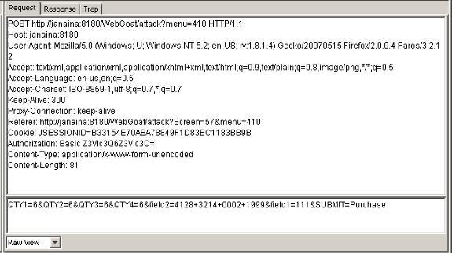

---

layout: col-sidebar
title: Manipulator-in-the-Middle attack
author: 
contributors: Kunal Gupta
permalink: /attacks/Manipulator-in-the-middle_attack
tags: attack, Manipulator-in-the-middle attack, MITM
auto-migrated: 1

---



## Description

The Manipulator-in-the Middle attack (MITM) intercepts a communication between two
systems. For example, in an HTTP transaction the target is the TCP
connection between client and server. Using different techniques, the
attacker splits the original TCP connection into two new connections, one
between the client and the attacker and the other between the attacker
and the server, as shown in figure 1. Once the TCP connection is
intercepted, the attacker acts as a proxy, being able to read, insert
and modify the data in the intercepted communication.

The MITM attack is particularly effective when unencrypted HTTP is used,
as headers and payloads are transmitted in cleartext. This allows an
attacker to view and intervene within the HTTP protocol as well as modify
the data being transferred. So, for example, it’s possible to capture a session
cookie reading the HTTP header, but it’s also possible to change an
amount of money transaction inside the application context, as shown in
figure 1.

*Figure 1. Illustration of a HTTP Packet intercepted with Paros Proxy.*

The MITM attack could also be done over an HTTPS connection by using the
same technique; the primary difference is the establishment of two
independent TLS sessions, one over each TCP connection. The browser sets
a TLS connection with the attacker, and the attacker establishes another
TLS connection with the web server. In general, browsers warn users when 
an untrusted or invalid digital certificate is presented; however, users may
ignore these warnings due to a lack of understanding of the associated risks. 
In some specific contexts it’s possible that the warning doesn’t appear, as for
example, when the server certificate is compromised by the attacker or
when the attacker certificate is signed by a trusted CA and the Common Name (CN) 
matches the original website.

MITM is not only an attack technique, but is also commonly used during
web application development and vulnerability assessments.

### MITM Attack tools

There are several tools to realize a MITM attack. These tools are
particularly efficient in LAN network environments, because they
implement extra functionalities, like ARP spoofing capabilities that
permit the interception of communication between hosts.

  - PacketCreator
  - Ettercap
  - Dsniff
  - Cain e Abel

### MITM Proxy only tools

Proxy tools only permit interaction with the parts of the HTTP
protocol, like the header and the body of a transaction, but do not have
the capability to intercept the TCP connection between client and
server. To intercept the communication, it’s necessary to use other
network attack tools or configure the browser.

  - [OWASP WebScarab](OWASP_WebScarab "wikilink")
  - Paros Proxy
  - Burp Proxy
  - ProxyFuzz
  - Odysseus Proxy
  - Fiddler (by Microsoft)
  - [mitmproxy](https://mitmproxy.org/)

## Related Threat Agents

  - Intranet Attacker

## Related [Attacks](https://owasp.org/www-community/attacks/)

  - [Man-in-the-browser_attack](https://owasp.org/www-community/attacks/Man-in-the-browser_attack)

## Related [Vulnerabilities](https://owasp.org/www-community/vulnerabilities/)

  - Session Management Vulnerability

## Related [Controls](https://owasp.org/www-community/controls/)

  - Enforce HTTPS and HSTS  
  - Secure session management  
  - Proper certificate validation 

## References

  - https://www.sans.org/reading_room/whitepapers/threats/480.php
  - https://cwe.mitre.org/data/definitions/300.html
  - https://www.infosecinstitute.com/resources/hacking/man-in-the-middle-demystified/
  - https://en.wikipedia.org/wiki/Man-in-the-middle_attack
  - [OWASP ASDR Project](https://owasp.org/www-pdf-archive/Developing_Secure_Applications_with_OWASP.pdf)
