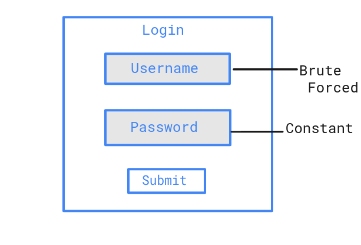



## Description
**Password spraying** is a type of brute force attack. In this attack, an attacker will brute force logins based on list of usernames with default passwords on the application. 
For example, an attacker will use one password (say, Secure@123) against many different accounts on the application to avoid account lockouts that would normally occur when brute forcing a single account with many passwords.

This attack can be found commonly where the application or admin sets a default password for the new users.

## Mitigations
- Brute force preventation should be on both field, i.e., Username and Password.
- Set account lockout policies after a certain number of failed login attempts to prevent credentials from being guessed. Implement CAPTCHA, if lockout is not a viable option.
- The admin managed application should force users to change their password on first login with default password.
- Use multi-factor authentication. Where possible, also enable multi-factor authentication on externally facing services.

## Reference
- https://attack.mitre.org/techniques/T1110/003/
- https://www.microsoft.com/security/blog/2020/04/23/protecting-organization-password-spray-attacks/
- [Credential Stuffing](Credential_stuffing)
