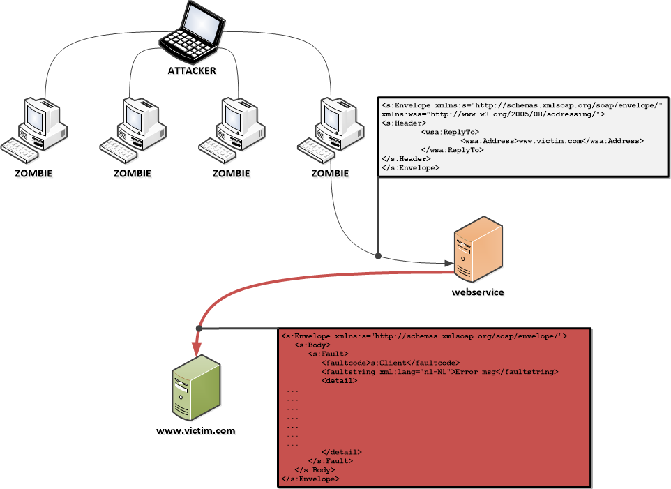
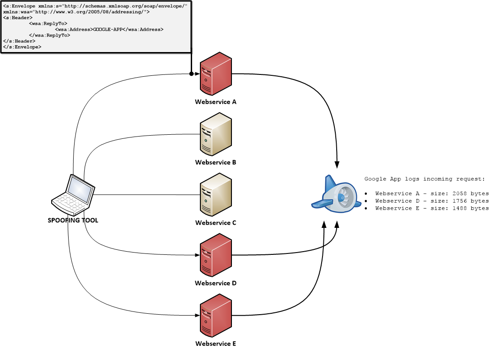

---

layout: col-sidebar
title: Web Service Amplification Attack
author: Thomas Vissers
contributors: Samantha Groves, Kait Disney-Leugers, kingthorin
permalink: /attacks/web_services_amplification
tags: attack

---



**Note:** This content hasn't been updated since the early twenty-teens. It does not appear that the python or google app components ever progressed very far (or even to a useful state). However, it is still possible to fairly easily test the concept via a personal proxy (ZAP, Burp, etc), and setup a web server or watch with Wireshark for reflected traffic.

## Description

Currently, DNS servers are widely misused to amplify DoS traffic. This is called a [DNS Amplification or Reflective attack](https://blog.cloudflare.com/deep-inside-a-dns-amplification-ddos-attack). It appears that SOAP webservices that implement WS-Addressing might be vulnerable to similar abuse, as stated in this paper The aim of the project is to investigate web service frameworks and develop tools to test this vulnerability and determine the threat magnitude on a global scale.

Ideas, development and all other contributions are more than welcome. This page will be updated with the current progress and to-do's. Feel free to contact the project leader for any questions.

## Attack Scenario

In the image below, the possible attack scenario is depicted. Very similar to the DNS amplification attack, the attacker commands a botnet to access a third party, here, a webservice. The request to the webservice contains a WS-Addressing header that specifies the victim's address as the ReplyTo or FaultTo address. The webservice replies to this address with a message that is potentially larger in size than the original request, effectively amplifying the attack. 

## Vulnerability Investigation

To determine the magnitude of this vulnerability, the project works on two paths:

- Development of a tool that can test public webservices and determine their number and amplification factor
- Look into the different webservice frameworks (Axis, CXF, .NET, ...) and find out their WS-Addressing behaviour.

## Tool to Determine Threat Magnitude

The tool contains 3 parts:

- Webservice crawler (WSA_spoof.py)
    - Finds webservices and their corresponding WSDLs
- Webservice client generator (WSA_spoof.py)
    - Generates a client from the WSDL and sends an empty request with a WS-Addressing header, with a ReplyTo that points to the Google App
- Public reply logger (GoogleApp_code.py - Google App)
    - Public reachable web application that listens to incoming requests and logs them.

In the image below, the last two parts are displayed. Development of these has started as a draft [here](https://github.com/VSSRS/WS-Amplification).

## Main TO-DO List

- In order to properly research this threat, we need to crawl or find public accessible webservices. The former big UDDI registers have all been shut down.
    - Currently, a 'simple' Google search is used to track down public webservices. 
- Further develop the tool.
    - A draft of the spoofing and Google App is made in Python. Can be found [here](https://github.com/VSSRS/WS-Amplification).

## WS-Addressing Default Behaviours

In order to get a grasp of the magnitude of this threat, it is also necessary to be aware of the default behaviour and settings in the existing web service frameworks. So far, Axis2 and JAX-WS (Metro) have been confirmed to enable it without the user specifying the need for it. Potentially creating a lot of web services that are unnecessarily prone to abuse. 

### Axis2

Axis2 enables WS-Addressing by default, as stated [here](https://axis.apache.org/axis2/java/core/modules/addressing/).

### CXF

CXF supports WS-Addressing, but [explicit configuration](https://cxf.apache.org/docs/ws-addressing.html) is required to enable it. 

### JAX-WS & Metro

Metro is based on the JAX-WS API. The [documentation](https://metro.java.net/1.4/docs/wsaddressing.html) says:
> "In Metro, if WS-Addressing is explicitly disabled then the RI does not follow the rules of engagement. However if WS-Addressing is either implicitly or explicitly enabled then Metro engages WS-Addressing based upon the presence of wsa:Action header. "

### .NET Framework

.NET/WCF supports WS-Addressing, but the default behaviour on a RepyTo field is unclear.

### Framework/Server TO-DO List

- More information about .NET/WCF is needed.
- Specifically test a Metro webservice with a random wsa:Action header.

## Further Details

Dec 2013: Confirmed on Axis2

> "I've just done a Web Services VA of some components hosted via Axis2 and can confirm that I can use WS Amplification to DoS a third party by altering the wsa:Address within wsa:ReplyTo. Sadly I had limited options while testing so my box initiating the requests also had to be receiving them, but I can differentiate inbound vs outbound traffic and definitely see an inbound spike which without too much more effort could easily result in a DoS."

>> To be specific this was against Axis2 1.5.4. Though I doubt it makes much of a difference given what appears in the change logs for the latest versions (no updates lately, newest seems to be 1.5.6 which was released in Aug 2011).