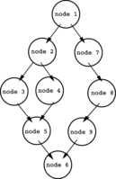
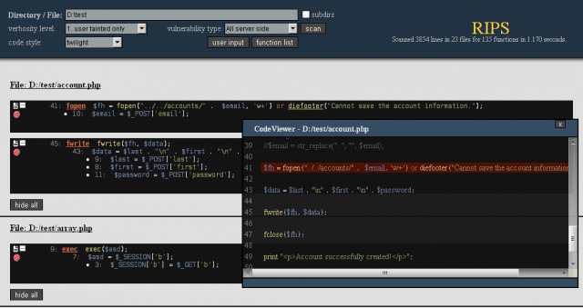
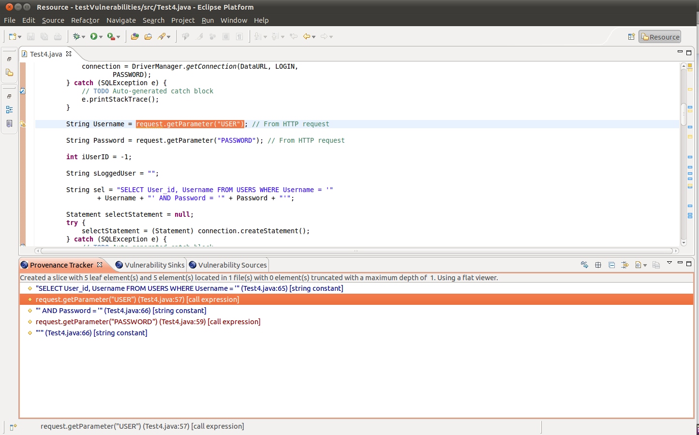

---

layout: col-sidebar
title: Static Code Analysis
author: Ryan Dewhurst
contributors: KirstenS, Nick Bloor, Sarah Baso, James Bowie, Ram ch, EvgeniyRyzhkov, Iberiam, Ann.campbell, Ejohn20, Jonathan Marcil, Christina Schelin, Jie Wang, Fabian, Achim, Dirk Wetter, kingthorin
tags: controls, source code analysis, static code analysis
permalink: /controls/Static_Code_Analysis

---



## Description

Static Code Analysis (also known as Source Code Analysis) is usually
performed as part of a Code Review (also known as white-box testing) and
is carried out at the Implementation phase of a Security Development
Lifecycle (SDL). Static Code Analysis commonly refers to the running of
Static Code Analysis tools that attempt to highlight possible
vulnerabilities within 'static' (non-running) source code by using
techniques such as Taint Analysis and Data Flow Analysis.

Ideally, such tools would automatically find security flaws with a high
degree of confidence that what is found is indeed a flaw. However, this
is beyond the state of the art for many types of application security
flaws. Thus, such tools frequently serve as aids for an analyst to help
them zero in on security relevant portions of code so they can find
flaws more efficiently, rather than a tool that simply finds flaws
automatically.

Some tools are starting to move into the Integrated Development
Environment (IDE). For the types of problems that can be detected during
the software development phase itself, this is a powerful phase within
the development lifecycle to employ such tools, as it provides immediate
feedback to the developer on issues they might be introducing into the
code during code development itself. This immediate feedback is very
useful as compared to finding vulnerabilities much later in the
development cycle.

The UK Defense Standard 00-55 requires that Static Code Analysis be used
on all 'safety related software in defense equipment'.<sup>\[0\]</sup>

## Techniques

There are various techniques to analyze static source code for potential
vulnerabilities that maybe combined into one solution. These techniques
are often derived from compiler technologies.

### Data Flow Analysis

Data flow analysis is used to collect run-time (dynamic) information
about data in software while it is in a static state ([Wögerer, 2005](http://citeseerx.ist.psu.edu/viewdoc/summary?doi=10.1.1.394.5540)).

There are three common terms used in data flow analysis, basic block
(the code), Control Flow Analysis (the flow of data) and Control Flow
Path (the path the data takes):

Basic block: A sequence of consecutive instructions where control enters
at the beginning of a block, control leaves at the end of a block and
the block cannot halt or branch out except at its end ([Wögerer, 2005](http://citeseerx.ist.psu.edu/viewdoc/summary?doi=10.1.1.394.5540)).

Example PHP basic block:

```php
$a = 0;
$b = 1;

if ($a == $b)
{ # start of block
  echo “a and b are the same”;
} # end of block
else
{ # start of block
  echo “a and b are different”;
} # end of block
```

### Control Flow Graph (CFG)

An abstract graph representation of software by use of nodes that
represent basic blocks. A node in a graph represents a block; directed
edges are used to represent jumps (paths) from one block to another. If
a node only has an exit edge, this is known as an ‘entry’ block, if a
node only has a entry edge, this is know as an ‘exit’ block ([Wögerer, 2005](http://citeseerx.ist.psu.edu/viewdoc/summary?doi=10.1.1.394.5540)).

Example Control Flow Graph; ‘node 1’ represents the entry block and
‘node 6’ represents the exit block.



### Taint Analysis

Taint Analysis attempts to identify variables that have been 'tainted'
with user controllable input and traces them to possible vulnerable
functions also known as a 'sink'. If the tainted variable gets passed to
a sink without first being sanitized it is flagged as a vulnerability.

Some programming languages such as Perl and Ruby have Taint Checking
built into them and enabled in certain situations such as accepting data
via CGI.

### Lexical Analysis

Lexical Analysis converts source code syntax into ‘tokens’ of
information in an attempt to abstract the source code and make it easier
to manipulate (Sotirov, 2005).

Pre-tokenised PHP source code:

`<?php $name = "Ryan"; ?>`

Post tokenised PHP source code:

```
T_OPEN_TAG
T_VARIABLE
=
T_CONSTANT_ENCAPSED_STRING
;
T_CLOSE_TAG

```

## Strengths and Weaknesses

### Strengths

- Scales Well (Can be run on lots of software, and can be repeatedly (like in nightly builds))
- For things that such tools can automatically find with high confidence, such as buffer overflows, SQL Injection Flaws, etc. they are great.

### Weaknesses

- Many types of security vulnerabilities are very difficult to find automatically, such as authentication problems, access control issues, insecure use of cryptography, etc. The current state of the art only allows such tools to automatically find a relatively small percentage of application security flaws. Tools of this type are getting better, however.
- High numbers of false positives.
- Frequently can't find configuration issues, since they are not represented in the code.
- Difficult to 'prove' that an identified security issue is an actual vulnerability.
- Many of these tools have difficulty analyzing code that can't be compiled. Analysts frequently can't compile code because they don't have the right libraries, all the compilation instructions, all the code, etc.

## Limitations

### False Positives

A static code analysis tool will often produce false positive results
where the tool reports a possible vulnerability that in fact is not.
This often occurs because the tool cannot be sure of the integrity and
security of data as it flows through the application from input to
output.

False positive results might be reported when analysing an application
that interacts with closed source components or external systems because
without the source code it is impossible to trace the flow of data in
the external system and hence ensure the integrity and security of the
data.

### False Negatives

The use of static code analysis tools can also result in false negative
results where vulnerabilities result but the tool does not report them.
This might occur if a new vulnerability is discovered in an external
component or if the analysis tool has no knowledge of the runtime
environment and whether it is configured securely.

## Important Selection Criteria

- Requirement: Must support your language, but not usually a key factor once it does.
- Types of Vulnerabilities it can detect (The OWASP Top Ten?) (more?)
- Does it require a fully buildable set of source?
- Can it run against binaries instead of source?
- Can it be integrated into the developer's IDE?
- License cost for the tool. (Some are sold per user, per org, per app, per line of code analyzed. Consulting licenses are frequently different than end user licenses.)
- Does it support Object-oriented programming (OOP)?

## Examples

### RIPS PHP Static Code Analysis Tool



### OWASP LAPSE+ Static Code Analysis Tool



### Tool Lists

- [OWASP - Source Code Analysis Tools](../Source_Code_Analysis_Tools)
- [NIST - Source Code Security Analyzers](http://samate.nist.gov/index.php/Source_Code_Security_Analyzers.html)
- [Wikipedia - List of tools for static code analysis](http://en.wikipedia.org/wiki/List_of_tools_for_static_code_analysis)

## Further Reading

- [RIPS](https://sourceforge.net/projects/rips-scanner/)
- [pixy](http://seclab.nu/static/publications/ssp2006pixy.pdf)
