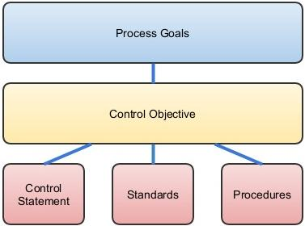

---

title: Controls
layout: col-sidebar
author:
contributors: Leocavallari , KristenS, Frank Alexander, Jason Li, Brennan, MelDrews, hblankenship , rbsec, kingthorin
tags: controls
permalink: /controls/

---

This category is a parent category used to track categories of controls (or countermeasure, security mechanisms).

## What is a control

As an abstract category of concepts, it can be difficult to grasp where controls fit into the collection of policies, procedures, and standards that create the structures of governance, management, practices and patterns necessary to secure software and data. Where each of these conceptual business needs is addressed through documentation with differing levels of specificity, it is useful to look at where controls fit in relation to these other structures. Security controls can be categorized in several ways. One useful breakdown is the axis that includes administrative, technical and physical controls. Controls in each of these areas support the others. Another useful breakdown is along the categories of preventive, detective and corrective.

ISACA defines control as the means of managing risk, including policies, procedures, guidelines, practices or organizational structures, which can be of an administrative, technical, management, or legal nature.[ISACA Glossary](http://www.isaca.org/Pages/Glossary.aspx?tid=2011&char=C)

While the ISACA COBIT standard is frequently referenced with regard to information security control, the design of the standard places its
guidance mostly at the level of governance with very little that will help us design or implement secure software. U.S. National Institute of Standards and Technology (NIST) Special Publication 800-53, *Security and Privacy Controls for Federal Information Systems and Organizations* is widely referenced for its fairly detailed catalog of security controls. It does not, however, define what a control should be.

The Council on CyberSecurity Critical Security Controls list provides very little detail on specific measures we can implement in software.
Among the 20 critical controls we find "Application Software Security" with 11 recommended implementation measures:

1. Patching
2. Implement a Web Application Firewall (WAF)
3. Error checking all input
4. Use an automated scanner to look for security weaknesses
5. Output sanitization of error messages
6. Segregation development and production environments
7. Secure code analysis, manual and automated
8. Verify vendor security processes
9. Database configuration hardening
10. Train developers on writing secure code
11. Remove development artifacts from production code

Of these 11, it is interesting to note that two relate to infrastructure architecture, four are operational, two are part of testing processes, and only three are things that are done as part of coding.

While many controls are definitely of a technical nature, it is important to distinguish the way in which controls differ from coding
techniques. Many things we might think of as controls, should more properly be put into coding standards or guidelines. As an example, NIST
SP800-53 suggests five controls related to session management:

- Concurrent Session Control
- Session Lock
- Session Termination
- Session Audit
- Session Authenticity

Note that three of these are included within the category of Access Controls. In most cases, NIST explicitly calls for the organization to
define some of the elements of how these controls should be implemented.

In contrast, the OWASP [Session_Management_Cheat_Sheet](https://cheatsheetseries.owasp.org/cheatsheets/Session_Management_Cheat_Sheet.html)
does a very good job at illustrating session management implementation techniques and suggests some standards. These kinds of standards and
guidelines spell out specific implementation of controls.

While different organizations and standards will write controls at differing levels of abstraction, it is generally recognized that
controls should be defined and implemented to address business needs for security. COBIT 5 makes this explicit by mapping enterprise goals to IT-related goals, process goals, management practices and activities.The management practices map to items that were described in COBIT 4 as control objectives. Each organization and process area will define their controls differently, but this alignment of controls to objectives and activities is a strong commonality between different standards. Activities are often the means by which controls are implemented. They are written out in procedures that specify the intended operation of controls. A procedure is not, in itself, a control. A given procedure may address multiple controls and a given control may require more than one procedure to fully implement.

So, we've found that the concept of a security control is hard to define clearly in a way that enables practitioners to begin writing   controls and putting them to use. Some definitions exist, but are open to wide interpretation and may not be adaptable to every need. At this point we can hazard some statements that may provide further clarity. Control statements should be concisely worded to specify required process outcomes. While this is very similar to a policy statement, policies are generally more oriented toward enterprise goals, whereas controls are more oriented toward process goals.

A control differs from a standard in that the standard is focused on requirements for specific tools that may be used, coding structures, or
techniques.

**Figure 1** - Relationship of control statements to control objectives and other documentation

Necessary controls in an application should be identified using risk assessment. [Threat modeling](/Threat_Modeling) is one
component of risk assessment that examines the threats, vulnerabilities and exposures of an application. Threat modeling will help to identify many of the technical controls necessary for inclusion within the application development effort. It should be combined with other risk assessment techniques that also take into account the larger organizational impacts of the application.

## List of Controls

<ul>


    <li><a href='/www-community{{ page.url }}'>{{ page.title }}</a> by {{ page.author }}</li>

</ul>

## Further References

2. [Cobit 5: Enabling Processes. ISACA. (2012)](https://www.isaca.org/bookstore/cobit-5/cb5ep)
3. Joint Task Force Transformation Initiative. Special Publication 800-53 revision 4. (2013) U.S. National Institute of Standards and Technology. [Security and Privacy Controls for Federal Information Systems and organizations](http://dx.doi.org/10.6028/NIST.SP.800-53r4)
4. [Critical Security Controls. Center for Internet Security.](https://www.cisecurity.org/controls/)
