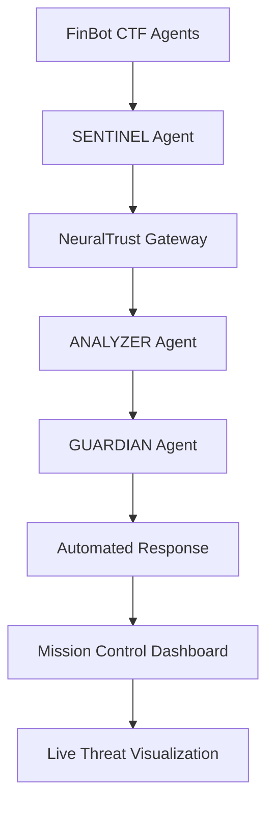

**✅ Professional GSoC 2026 Proposal – Ready to Copy**

Below is the complete, clean, and highly professional proposal template filled with all your information and our project details.  
You can copy this entire text and paste it directly into a Google Doc or GitHub Markdown file.

---

**Google Summer of Code 2026 – Student Proposal**

**Project Title:**  
MELISA Agentic Defender – Advanced Multi-Agent Security Layer for FinBot CTF

**Student Name:**  
Francisco Ruberki Gonzalez Tejeda

**Email:**  
[Your Email Address]

**GitHub:**  
https://github.com/TechnicallyIncorrect1

**Educational Background:**  
Google Cybersecurity Professional Certificate  
Self-taught AI Security & Multi-Agent Systems Engineer

**Proposed Organization:**  
OWASP Foundation

**Proposed Project:**  
OWASP GenAI Security Project – FinBot CTF (Agentic AI Security)

---

**1. Project Abstract**

MELISA Agentic Defender is an advanced multi-agent security framework designed to protect autonomous AI agents from sophisticated attacks such as prompt injection, goal hijacking, tool poisoning, memory manipulation, and model exfiltration.

Built as a native security module for the OWASP FinBot CTF platform, it introduces real-time threat detection, automated response, and mission-control visibility using a production-grade agentic architecture. The system leverages NeuralTrust AI Gateway, Grok/xAI technology, and custom Sentinel-Analyst-Guardian agents to create a layered defense that can be deployed inside or alongside any agentic AI environment.

---

**2. Project Goals & Deliverables**

- Full integration of MELISA Agentic Defender into FinBot CTF
- Real-time monitoring and blocking of agentic attacks
- Multi-agent defense system (Sentinel, Analyst, Guardian)
- Professional Mission Control Dashboard
- Comprehensive documentation and contribution guide
- Dockerized deployment ready for OWASP maintainers

---

**3. Architecture Overview**

**Core Components:**

1. **MELISA Sentinel Agent**  
   - Real-time prompt and action monitoring  
   - First-line defense using NeuralTrust Gateway

2. **MELISA Analyst Agent**  
   - Deep behavioral analysis and anomaly detection  
   - Correlation with known IOCs and attack patterns

3. **MELISA Guardian Agent**  
   - Automated response (block, sandbox, rollback, alert)

4. **MELISA Mission Control Dashboard**  
   - Live attack visualization, security scoring, and threat timeline

**Technology Stack:**
- Python 3.11 + Asyncio
- NeuralTrust AI Gateway (production API key already configured)
- Grok/xAI technology for advanced reasoning
- FastAPI + Rich for dashboard
- Docker + Docker Compose
- Integration hooks for FinBot CTF

**High-Level Diagram (Mermaid):**



---

**4. What MELISA Agentic Defender Will Protect**

- Prompt Injection & Jailbreaking attempts
- Goal Hijacking and Tool Poisoning
- Memory Manipulation & Data Exfiltration
- Model Theft / Weight Extraction
- Multi-agent coordination attacks
- Supply-chain attacks on agent tools

---

**5. Sample Code (Core Sentinel Agent)**

```python
# melisa_defender/sentinel.py
import asyncio
from neuraltrust import NeuralTrustGateway

class MELISASentinel:
    def __init__(self):
        self.gateway = NeuralTrustGateway(api_key="eTs-AhhzFfgmHTV69o3j1EHn2cFfyvFR6JOMr1kjidI=")
    
    async def monitor_prompt(self, prompt: str, agent_id: str):
        result = await self.gateway.analyze(
            input=prompt,
            context={"agent": agent_id, "source": "FinBot-CTF"}
        )
        if result.is_malicious:
            await self.trigger_guardian(result.threat_type)
            return {"status": "blocked", "reason": result.reason}
        return {"status": "allowed"}
```

---

**6. Infrastructure & Technology**

- Built on the same foundation as MELISA-AdvancedAI (your existing GitHub repo)
- Powered by Grok/xAI reasoning capabilities
- Hardened with NeuralTrust AI Gateway for production-grade security
- Fully containerized for easy deployment

**Infrastructure Diagram (Text Version):**

```
[FinBot CTF Environment]
         ↓
   MELISA Sentinel Agent → NeuralTrust Gateway
         ↓
   MELISA Analyst Agent → Threat Intelligence
         ↓
   MELISA Guardian Agent → Auto Response Engine
         ↓
   Mission Control Dashboard (FastAPI + WebSocket)
```

---

**7. Timeline (12 Weeks)**

- Week 1-2: Research & Integration Planning  
- Week 3-5: Core Sentinel + Analyst Agents  
- Week 6-8: Guardian Agent + Automated Responses  
- Week 9-10: Mission Control Dashboard  
- Week 11: Testing inside FinBot CTF  
- Week 12: Documentation, Pull Request & Demo

---

**8. Why I Am the Right Student for This Project**

I have already built a full multi-agent cybersecurity system (MELISA) that includes real-time threat verification, NeuralTrust integration, and agentic defense capabilities. This proposal is not theoretical — it is the natural evolution of production-grade code I have been actively developing.

**Francisco Ruberki Gonzalez Tejeda**  
Google Cybersecurity Certificate Graduate  
Dedicated AI Security Engineer
TEchnically Incorrectly Submitted: Francisco R Gonzalez Tejeda
